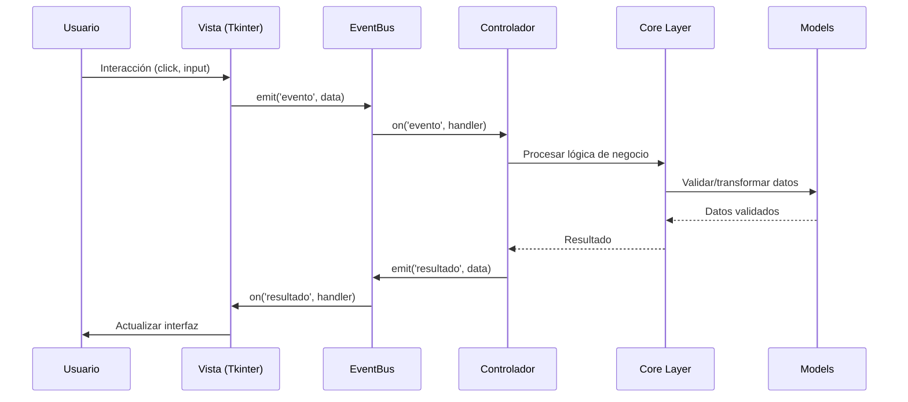
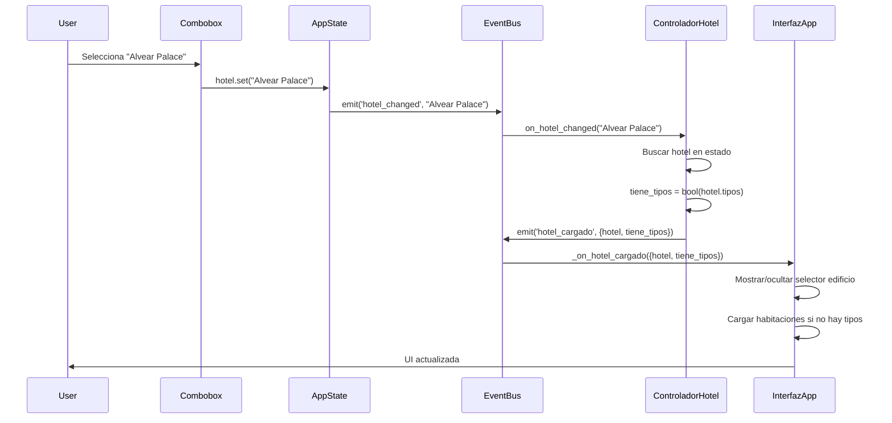
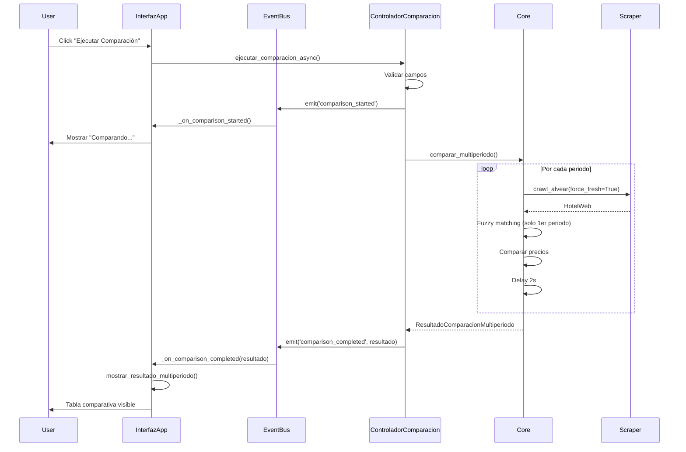

# Arquitectura Event-Driven MVC

El proyecto usa una arquitectura **MVC (Model-View-Controller)** con comunicación basada en **eventos (EventBus)** para desacoplar componentes.

## Diagrama de Flujo



## Componentes Principales

### 1. EventBus (Sistema Pub/Sub)

**Ubicación**: [UI/state/event_bus.py](../../Hoteles/UI/state/event_bus.py)

El EventBus implementa el patrón **Observer/Publish-Subscribe** para comunicación desacoplada entre componentes.

#### API Principal

```python
class EventBus:
    def on(self, event_name: str, callback: Callable):
        """
        Suscribe un callback a un evento.

        Args:
            event_name: Nombre del evento
            callback: Función a llamar cuando se emite el evento
        """
        pass

    def emit(self, event_name: str, data=None):
        """
        Emite un evento a todos los suscriptores.

        Args:
            event_name: Nombre del evento
            data: Datos a pasar al callback (opcional)
        """
        pass

    def off(self, event_name: str, callback: Callable):
        """Desuscribe un callback de un evento."""
        pass

    def clear(self, event_name: str = None):
        """Limpia listeners (todos o de un evento específico)."""
        pass

    def enable_debug(self):
        """Activa modo debug (imprime todos los eventos emitidos)."""
        pass
```

#### Ejemplo de Uso

```python
# Crear EventBus
event_bus = EventBus()

# Suscribirse a evento
def on_hotel_changed(hotel_nombre):
    print(f"Hotel cambió a: {hotel_nombre}")

event_bus.on('hotel_changed', on_hotel_changed)

# Emitir evento
event_bus.emit('hotel_changed', 'Alvear Palace')
# Output: Hotel cambió a: Alvear Palace
```

#### Debug Mode

Para debugging, activar modo debug en `UI/interfaz.py`:

```python
def __init__(self, root):
    self.event_bus = EventBus()
    self.event_bus.enable_debug()  # ← Activar aquí
```

Output:
```
[EventBus] Evento 'hotel_changed' emitido con data: Alvear Palace
[EventBus] → Llamando callback: <function on_hotel_changed at 0x...>
```

---

### 2. AppState (Estado Centralizado)

**Ubicación**: [UI/state/app_state.py](../../Hoteles/UI/state/app_state.py)

Gestiona el estado global de la aplicación usando variables Tkinter (`StringVar`, `IntVar`, etc.).

#### Variables de Estado

```python
class AppState:
    # === Variables de selección ===
    hotel: tk.StringVar              # Hotel seleccionado
    edificio: tk.StringVar           # Edificio/tipo seleccionado
    habitacion: tk.StringVar         # Habitación seleccionada

    # === Variables de fecha ===
    fecha_dia_entrada: tk.StringVar
    fecha_mes_entrada: tk.StringVar
    fecha_ano_entrada: tk.StringVar
    fecha_entrada_completa: tk.StringVar  # DD-MM-AAAA

    fecha_dia_salida: tk.StringVar
    fecha_mes_salida: tk.StringVar
    fecha_ano_salida: tk.StringVar
    fecha_salida_completa: tk.StringVar

    # === Variables de huéspedes ===
    adultos: tk.IntVar               # Default: 1
    ninos: tk.IntVar                 # Default: 0

    # === Variables de resultado ===
    precio: tk.StringVar             # Precio calculado o "(ninguna seleccionada)"
    periodos_var: tk.StringVar       # Auxiliar

    # === Datos cargados ===
    hoteles_excel: list[HotelExcel]
    habitaciones_excel: list[HabitacionExcel]
    habitaciones_unificadas: list[HabitacionUnificada]
    habitacion_web: HabitacionWeb | None
    resultado_multiperiodo: ResultadoComparacionMultiperiodo | None
```

#### Traces (Auto-eventos)

AppState configura **traces** en variables clave para emitir eventos automáticamente:

```python
def _setup_traces(self):
    """Emite eventos cuando cambian variables usando trace_add."""
    self.hotel.trace_add('write',
        lambda *args: self.event_bus.emit('hotel_changed', self.hotel.get()))

    self.edificio.trace_add('write',
        lambda *args: self.event_bus.emit('edificio_changed', self.edificio.get()))

    self.habitacion.trace_add('write',
        lambda *args: self.event_bus.emit('habitacion_changed', self.habitacion.get()))
```

**Flujo**:
1. Usuario selecciona hotel en Combobox
2. Combobox actualiza `AppState.hotel` (StringVar)
3. Trace detecta cambio → emite `hotel_changed`
4. ControladorHotel escucha `hotel_changed` → carga edificios
5. Emite `hotel_cargado` → InterfazApp actualiza UI

---

### 3. Model (Modelos Pydantic)

**Ubicación**: [Models/](../../Hoteles/Models/)

Modelos de datos con validación automática usando Pydantic v2.

#### Modelos Excel

- **HotelExcel**: Hotel completo con tipos/habitaciones directas + periodos
- **TipoHabitacionExcel**: Edificio/tipo que agrupa habitaciones
- **HabitacionExcel**: Habitación con precio y periodo_ids
- **Periodo**: Rango de fechas con ID auto-incremental
- **HabitacionUnificada**: Bridge para habitaciones con/sin tipos

#### Modelos Web

- **HotelWeb**: Colección de habitaciones scrapeadas
- **HabitacionWeb**: Habitación con combos de precios
- **ComboPrecio**: Opción de precio (título + descripción + precio)

#### Ejemplo de Validación

```python
from Models.hotelExcel import HabitacionExcel

# Validación exitosa
hab = HabitacionExcel(
    nombre="Double Superior",
    precio=150.0,
    row_idx=10,
    periodo_ids={1, 2}
)

# Validación fallida - precio negativo
try:
    hab = HabitacionExcel(
        nombre="Double Superior",
        precio=-50.0,  # ← ERROR
        row_idx=10
    )
except ValidationError as e:
    print(e)
    # ValidationError: Precio debe ser >= 0
```

---

### 4. View (Vistas Tkinter)

Las vistas son componentes UI que renderizan interfaz y capturan input del usuario.

#### Jerarquía

```
InterfazApp (ventana principal)
├── FormularioSeleccionHotel (vista compuesta)
│   ├── LabeledComboBox (hotel)
│   ├── LabeledComboBox (edificio) [dinámico]
│   └── LabeledComboBox (habitación)
├── FormularioReserva (vista compuesta)
│   ├── DateInputWidget (entrada)
│   ├── DateInputWidget (salida)
│   ├── EntradaEtiquetada (adultos)
│   └── EntradaEtiquetada (niños)
├── VistaResultados
│   └── Text widget con scrollbar
├── PrecioPanel
│   └── Canvas con precios
└── PeriodosPanel
    └── Text widget con periodos
```

#### BaseComponent Pattern

Todos los componentes heredan de `BaseComponent`:

```python
class MiComponente(BaseComponent):
    def _setup_ui(self):
        # Construir interfaz
        pass

    def get_value(self):
        # Retornar valor
        return self._value

    def set_value(self, value):
        # Establecer valor
        self._value = value
```

Ver detalles en [../desarrollo/convenciones.md](../desarrollo/convenciones.md#pattern-basecomponent)

---

### 5. Controller (Controladores)

Los controladores orquestan la lógica de negocio sin dependencias directas de UI.

#### Pattern Standard

```python
class MiControlador:
    def __init__(self, estado_app, event_bus):
        self.estado_app = estado_app
        self.event_bus = event_bus

        # Suscribirse a eventos
        self.event_bus.on('evento_entrada', self.handler)

    def handler(self, data):
        # Procesar
        resultado = self._procesar(data)

        # Actualizar estado
        self.estado_app.variable.set(resultado)

        # Emitir evento
        self.event_bus.emit('evento_salida', resultado)
```

#### Controladores del Proyecto

| Controlador | Responsabilidad | Eventos Escuchados | Eventos Emitidos |
|-------------|-----------------|-------------------|------------------|
| **ControladorHotel** | Carga hoteles/edificios/habitaciones | `hotel_changed`, `edificio_changed` | `hotel_cargado`, `habitaciones_cargadas` |
| **ControladorValidacion** | Validaciones de negocio | - | - |
| **ControladorComparacion** | Ejecución async de comparación | - | `comparison_started`, `comparison_completed`, `comparison_error` |
| **ControladorPrecios** | Cálculo dinámico de precios | `habitacion_changed`, fechas | `precios_actualizados` |

---

## Flujo Completo de Eventos

### Ejemplo: Selección de Hotel



### Ejemplo: Comparación Multi-Periodo



---

## Ventajas de Event-Driven MVC

### ✅ Desacoplamiento

Componentes no se conocen directamente:
- UI no importa Core directamente
- Controladores no importan widgets Tkinter
- Fácil testear controladores sin UI

### ✅ Reactividad

Cambios en estado → eventos automáticos → UI actualiza:
- `AppState.hotel` cambia → `hotel_changed` → UI actualiza dropdowns
- Sin polling, sin callbacks anidados

### ✅ Extensibilidad

Agregar nueva funcionalidad sin modificar código existente:
- Nuevo controlador se suscribe a eventos existentes
- Emite nuevos eventos que otros pueden escuchar
- No rompe código legacy

### ✅ Debugging

EventBus debug mode muestra todo el flujo:
```python
event_bus.enable_debug()
```

Output:
```
[EventBus] hotel_changed: "Alvear Palace"
[EventBus] hotel_cargado: {"hotel": <HotelExcel>, "tiene_tipos": True}
[EventBus] habitaciones_cargadas: ["dbl superior", "dbl deluxe", ...]
```

---

## Comparación con Alternativas

### vs. Callbacks Directos

**Callbacks directos**:
```python
class Vista:
    def __init__(self, controlador):
        self.controlador = controlador
        self.button.config(command=self.controlador.on_click)
```

❌ Acoplamiento fuerte
❌ Difícil testear
❌ Un solo listener por evento

**Event-Driven**:
```python
class Vista:
    def __init__(self, event_bus):
        self.event_bus = event_bus
        self.button.config(command=lambda: self.event_bus.emit('click'))

class Controlador:
    def __init__(self, event_bus):
        self.event_bus = event_bus
        self.event_bus.on('click', self.on_click)
```

✅ Desacoplamiento
✅ Fácil testear
✅ Múltiples listeners

---

## Mejores Prácticas

### 1. Nombrar Eventos Consistentemente

```python
# ✅ Correcto - verbos en pasado
'hotel_changed'
'comparison_completed'
'habitaciones_cargadas'

# ❌ Incorrecto - inconsistente
'change_hotel'
'compareComplete'
'load-rooms'
```

### 2. Data de Eventos Estructurada

```python
# ✅ Correcto - dict con keys claras
self.event_bus.emit('hotel_cargado', {
    'hotel': hotel,
    'tiene_tipos': bool(hotel.tipos)
})

# ❌ Incorrecto - data ambigua
self.event_bus.emit('hotel_cargado', (hotel, True))
```

### 3. Suscribirse en __init__, Limpiar en Destructor

```python
class MiControlador:
    def __init__(self, event_bus):
        self.event_bus = event_bus
        self.event_bus.on('evento', self.handler)

    def __del__(self):
        # Limpiar listener al destruir
        self.event_bus.off('evento', self.handler)
```

### 4. No Emitir Eventos Recursivos

```python
# ❌ MALO - Loop infinito
def on_hotel_changed(self, hotel):
    # ... proceso ...
    self.event_bus.emit('hotel_changed', hotel)  # ← Loop!

# ✅ BUENO - Evento diferente
def on_hotel_changed(self, hotel):
    # ... proceso ...
    self.event_bus.emit('hotel_procesado', hotel)
```

---

Ver también:
- [overview.md](overview.md) - Visión general de arquitectura
- [flujos-principales.md](flujos-principales.md) - Diagramas de flujos completos
- [../desarrollo/convenciones.md](../desarrollo/convenciones.md) - Convenciones de código