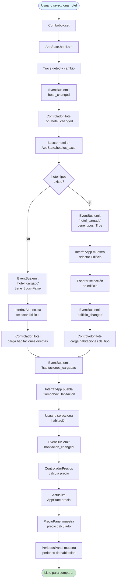
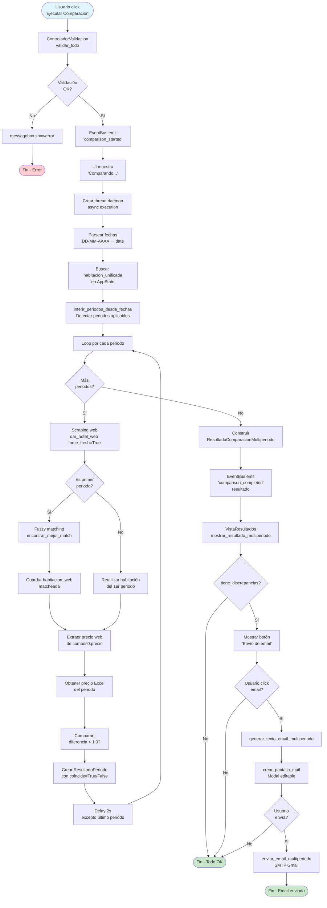

# Flujos Principales del Sistema

Este documento detalla los 3 flujos principales del sistema con diagramas mermaid y explicación paso a paso.

## Tabla de Contenidos

- [Flujo 1: Carga Inicial Excel → UI](#flujo-1-carga-inicial-excel--ui)
- [Flujo 2: Selección Hotel/Edificio/Habitación](#flujo-2-selección-hoteledificiohabitación)
- [Flujo 3: Comparación Multi-Periodo](#flujo-3-comparación-multi-periodo)

---

## Flujo 1: Carga Inicial Excel → UI

Este flujo se ejecuta al iniciar la aplicación (`python Hoteles/app.py`).

### Diagrama

```mermaid
flowchart TD
    Start([Inicio: python app.py]) --> LoadEnv[Cargar .env<br/>GROQ_API_KEY, GMTP_KEY]
    LoadEnv --> TestExtractor[Ejecutar testExtractor2.py<br/>Generar validación Excel]
    TestExtractor --> CreateRoot[Crear ventana Tkinter<br/>root = tk.Tk]
    CreateRoot --> CreateApp[InterfazApp.__init__]

    CreateApp --> InitEventBus[Crear EventBus]
    InitEventBus --> InitAppState[Crear AppState<br/>con traces configurados]
    InitAppState --> InitFonts[Crear FontManager]
    InitFonts --> InitControllers[Inicializar Controladores<br/>Hotel, Validacion, Comparacion, Precios]

    InitControllers --> LoadExcel[dar_hoteles_excel]
    LoadExcel --> ParseExcel[ExtractorDatos.parsear]
    ParseExcel --> ExcelData[(DatosExcel<br/>List HotelExcel)]

    ExcelData --> StateHoteles[AppState.hoteles_excel = datos.hoteles]
    StateHoteles --> PopulateCombo[Poblar Combobox Hotel<br/>con nombres sin (A)]

    PopulateCombo --> UIReady[UI Lista]
    UIReady --> Mainloop[root.mainloop]

    style Start fill:#e1f5ff
    style UIReady fill:#c8e6c9
    style Mainloop fill:#fff9c4
```

### Paso a Paso

#### 1. Carga de Entorno (app.py:1-5)

```python
# Cargar variables de entorno
load_dotenv()  # Lee Hoteles/.env

# Verificar GROQ_API_KEY
if not os.getenv("GROQ_API_KEY"):
    print("Error: GROQ_API_KEY no configurada")
    sys.exit(1)
```

**Archivos involucrados**:
- `Hoteles/.env` - Contiene `GROQ_API_KEY`, `GMTP_KEY`

---

#### 2. Test Extractor (app.py:10-15)

```python
# Ejecutar test de extractor (genera Extracto_Validacion.xlsx)
import Tests.testExtractor2 as test
```

**Propósito**: Validar que el extractor de Excel funciona correctamente antes de iniciar la app.

**Output**: `Hoteles/Data/Extracto_Validacion.xlsx`

---

#### 3. Crear Ventana Principal (app.py:20-25)

```python
root = tk.Tk()
root.title("Comparador de Precios - Multi-Periodo")
root.geometry("1200x700")
```

---

#### 4. Inicializar InterfazApp (UI/interfaz.py:__init__)

```python
class InterfazApp:
    def __init__(self, root):
        # FASE 1: Infraestructura Base
        self.event_bus = EventBus()
        self.state = AppState(self.event_bus)  # ← Configura traces
        self.fonts = FontManager(self.root)

        # FASE 2: Compatibilidad Legacy
        # Punteros a estado para acceso directo
        self.seleccion_hotel = self.state.hotel
        self.fecha_entrada_completa = self.state.fecha_entrada_completa
        # ...

        # FASE 3: Inicializar Controladores
        self.controlador_validacion = ControladorValidacion(self.state)
        self.controlador_hotel = ControladorHotel(self.state, self.event_bus)
        self.controlador_comparacion = ControladorComparacion(...)
        self.controlador_precios = ControladorPrecios(...)

        # FASE 4: Suscribir a eventos
        self.event_bus.on('comparison_started', self._on_comparison_started)
        self.event_bus.on('comparison_completed', self._on_comparison_completed)
        self.event_bus.on('hotel_cargado', self._on_hotel_cargado)
        # ...

        # FASE 5: Construir UI
        self._setup_ui()
```

---

#### 5. Cargar Datos de Excel (Core/controller.py:dar_hoteles_excel)

```python
def dar_hoteles_excel():
    """Carga hoteles desde Excel."""
    gestor = GestorDatos()  # ← Carga Excel en __init__
    return gestor.datos_excel.hoteles
```

**Flujo interno**:
1. `GestorDatos.__init__` → llama `_cargar_datos_excel()`
2. `ExtractorDatos.parsear(archivo)` → lee Excel fila por fila
3. Retorna `DatosExcel` con `List[HotelExcel]`

---

#### 6. Poblar UI (UI/interfaz.py:_setup_ui)

```python
def _setup_ui(self):
    # Cargar hoteles
    self.state.hoteles_excel = dar_hoteles_excel()

    # Poblar combobox
    hoteles_nombres = [h.nombre.replace(" (A)", "") for h in self.state.hoteles_excel]
    self.combo_hotel['values'] = list(set(hoteles_nombres))  # Sin duplicados
```

---

#### 7. UI Lista

Usuario ve ventana con:
- ✅ Combobox Hotel poblado
- ✅ Campos de fecha vacíos
- ✅ Botón "Ejecutar Comparación" deshabilitado (hasta seleccionar todo)

---

## Flujo 2: Selección Hotel/Edificio/Habitación

Este flujo se ejecuta cuando el usuario selecciona un hotel (cascada dinámica).

### Diagrama



### Paso a Paso

#### 1. Usuario Selecciona Hotel

Usuario hace click en Combobox Hotel → selecciona "Alvear Palace"

---

#### 2. AppState Actualiza (automático)

```python
# Combobox tiene textvariable=self.state.hotel
self.combo_hotel = ttk.Combobox(textvariable=self.state.hotel)

# Al seleccionar → AppState.hotel.set("Alvear Palace") se ejecuta automáticamente
```

---

#### 3. Trace Detecta Cambio (AppState)

```python
# Configurado en AppState.__init__
self.hotel.trace_add('write',
    lambda *args: self.event_bus.emit('hotel_changed', self.hotel.get()))
```

**Resultado**: `EventBus.emit('hotel_changed', 'Alvear Palace')`

---

#### 4. ControladorHotel Escucha Evento

```python
class ControladorHotel:
    def __init__(self, estado_app, event_bus):
        # ...
        self.event_bus.on('hotel_changed', self.on_hotel_changed)

    def on_hotel_changed(self, hotel_nombre):
        # Buscar hotel en estado
        hotel = next((h for h in self.estado_app.hoteles_excel
                     if hotel_nombre in h.nombre), None)

        if not hotel:
            return

        # Determinar si tiene tipos
        tiene_tipos = bool(hotel.tipos)

        # Emitir evento con datos del hotel
        self.event_bus.emit('hotel_cargado', {
            'hotel': hotel,
            'tiene_tipos': tiene_tipos
        })

        # Si NO tiene tipos → cargar habitaciones directas
        if not tiene_tipos:
            habitaciones = self.cargar_habitaciones(hotel_nombre)
            self.event_bus.emit('habitaciones_cargadas', habitaciones)
```

---

#### 5. InterfazApp Actualiza UI Dinámicamente

```python
def _on_hotel_cargado(self, data):
    hotel = data['hotel']
    tiene_tipos = data['tiene_tipos']

    if tiene_tipos:
        # Mostrar selector de edificio
        self.formulario_seleccion.mostrar_edificio(
            valores=[t.nombre for t in hotel.tipos]
        )
    else:
        # Ocultar selector de edificio
        self.formulario_seleccion.ocultar_edificio()
        # Ya se cargaron habitaciones en ControladorHotel
```

---

#### 6. Usuario Selecciona Edificio (si aplica)

Si el hotel tiene tipos:
1. Usuario selecciona edificio → `edificio_changed`
2. ControladorHotel carga habitaciones del edificio
3. Emite `habitaciones_cargadas`
4. InterfazApp puebla Combobox Habitación

---

#### 7. Usuario Selecciona Habitación

1. `habitacion_changed` evento
2. ControladorPrecios recibe evento
3. Busca habitación unificada en `AppState.habitaciones_unificadas`
4. Calcula precio según periodos aplicables
5. Actualiza `AppState.precio`
6. PrecioPanel muestra precio
7. PeriodosPanel muestra periodos de la habitación

---

## Flujo 3: Comparación Multi-Periodo

Este flujo se ejecuta cuando el usuario clickea "Ejecutar Comparación".

### Diagrama



### Paso a Paso

#### 1. Validación (ControladorValidacion)

```python
def validar_todo(self):
    # Validar fechas (formato DD-MM-AAAA)
    if not self.validar_fecha(fecha_entrada, "Fecha de entrada"):
        return False

    # Validar orden (salida > entrada)
    if not self.validar_orden_fechas(fecha_entrada, fecha_salida):
        return False

    # Validar campos completos (hotel, habitación, precio)
    if not self.validar_campos_completos():
        return False

    return True
```

---

#### 2. Emitir comparison_started

```python
self.event_bus.emit('comparison_started')
```

UI actualiza:
```python
def _on_comparison_started(self):
    self.vista_resultados.limpiar()
    self.vista_resultados.agregar("🔄 Comparando precios...\n", tags=("bold",))
```

---

#### 3. Ejecutar en Thread Daemon

```python
def ejecutar_comparacion_async(self):
    def run_async():
        asyncio.run(self._ejecutar_comparacion())

    thread = threading.Thread(target=run_async, daemon=True)
    thread.start()
```

**Por qué thread daemon?** UI Tkinter no debe bloquearse durante scraping (2-10s por periodo).

---

#### 4. Parsear Fechas y Buscar Habitación

```python
async def _ejecutar_comparacion(self):
    # Parsear fechas
    fecha_entrada = datetime.strptime(fecha_entrada_str, "%d-%m-%Y").date()
    fecha_salida = datetime.strptime(fecha_salida_str, "%d-%m-%Y").date()

    # Buscar habitación unificada
    habitacion_unificada = next(
        (h for h in self.estado_app.habitaciones_unificadas
         if h.nombre == habitacion_nombre),
        None
    )
```

---

#### 5. Inferir Periodos Aplicables

```python
from Core.servicio_habitaciones import inferir_periodos_desde_fechas

periodos_aplicables = inferir_periodos_desde_fechas(
    hotel,
    fecha_entrada,
    fecha_salida,
    habitacion_unificada.periodo_ids
)
```

**Lógica**: Detecta overlaps entre rango de reserva y periodos de la habitación.

---

#### 6. Loop Secuencial por Periodo

```python
for i, periodo in enumerate(periodos_aplicables):
    print(f"--- PERIODO {i+1}/{len(periodos_aplicables)} ---")

    # 6.1 Scraping con force_fresh=True
    hotel_web = await dar_hotel_web(
        fecha_entrada=periodo.fecha_inicio.strftime("%Y-%m-%d"),
        fecha_salida=periodo.fecha_fin.strftime("%Y-%m-%d"),
        adultos=adultos,
        ninos=ninos,
        force_fresh=True  # ← CRÍTICO
    )

    # 6.2 Fuzzy matching (solo 1er periodo)
    if i == 0:
        habitacion_web = encontrar_mejor_match(habitacion_unificada.nombre, hotel_web)
        habitacion_web_matcheada = habitacion_web  # Guardar
    else:
        # Reutilizar match del 1er periodo
        habitacion_web = next((h for h in hotel_web.habitacion
                              if h.nombre == habitacion_web_matcheada.nombre), None)

    # 6.3 Extraer precio web
    precio_web = habitacion_web.combos[0].precio if habitacion_web.combos else 0.0

    # 6.4 Obtener precio Excel
    precio_excel = habitacion_unificada.precio_para_periodo(periodo.id)

    # 6.5 Comparar
    diferencia = precio_web - precio_excel
    coincide = abs(diferencia) < 1.0

    # 6.6 Crear ResultadoPeriodo
    resultados_periodos.append(ResultadoPeriodo(
        periodo=periodo,
        precio_excel=precio_excel,
        precio_web=precio_web,
        diferencia=diferencia,
        coincide=coincide
    ))

    # 6.7 Delay (excepto último)
    if i < len(periodos_aplicables) - 1:
        await asyncio.sleep(SCRAPING_DELAY_SECONDS)  # Default: 2s
```

---

#### 7. Emitir comparison_completed

```python
resultado = ResultadoComparacionMultiperiodo(
    habitacion_excel_nombre=habitacion_unificada.nombre,
    habitacion_web_matcheada=habitacion_web_matcheada,
    periodos=resultados_periodos,
    tiene_discrepancias=any(not r.coincide for r in resultados_periodos),
    mensaje_match=f"Match: {habitacion_web_matcheada.nombre}"
)

self.event_bus.emit('comparison_completed', resultado)
```

---

#### 8. UI Muestra Tabla Comparativa

```python
def _on_comparison_completed(self, resultado):
    if isinstance(resultado, ResultadoComparacionMultiperiodo):
        self.vista_resultados.mostrar_resultado_multiperiodo(resultado)

        if resultado.tiene_discrepancias:
            # Mostrar botón de email
            self.btn_email.pack()
```

**Tabla ejemplo**:
```
┌──────────────┬─────────────┬────────────┬─────────────┬────────┐
│ Periodo      │ Precio Excel│ Precio Web │ Diferencia  │ Estado │
├──────────────┼─────────────┼────────────┼─────────────┼────────┤
│ low season   │ $150.00     │ $140.00    │ -$10.00     │ ❌ DIFF│
│ high season  │ $180.00     │ $180.00    │ $0.00       │ ✅ OK  │
└──────────────┴─────────────┴────────────┴─────────────┴────────┘
```

---

#### 9. Email (opcional)

Si usuario clickea "Envío de email":

```python
def crear_pantalla_mail(self):
    # Generar texto
    texto_email = generar_texto_email_multiperiodo(hotel, resultado)

    # Mostrar en ventana editable
    email_window = tk.Toplevel()
    text_widget = tk.Text(email_window)
    text_widget.insert('1.0', texto_email)

    # Botón enviar
    def enviar():
        enviar_email_multiperiodo(hotel, resultado, remitente, destinatario)

    ttk.Button(email_window, text="Enviar Email", command=enviar).pack()
```

---

## Tiempos Estimados

| Fase | Tiempo |
|------|--------|
| Carga inicial Excel → UI | ~2-3s (primera vez) |
| Selección hotel/edificio/habitación | Instantáneo (<100ms) |
| Comparación multi-periodo (3 periodos) | ~15s (3x2s scraping + 3x2s delay) |
| Generación email | <1s |
| Envío email SMTP | ~2-3s |

---

Ver también:
- [event-driven-mvc.md](event-driven-mvc.md) - Detalles de EventBus y MVC
- [../negocio/multiperiodo.md](../negocio/multiperiodo.md) - Lógica multi-periodo completa
- [../scraper/como-funciona.md](../scraper/como-funciona.md) - Detalles del scraper