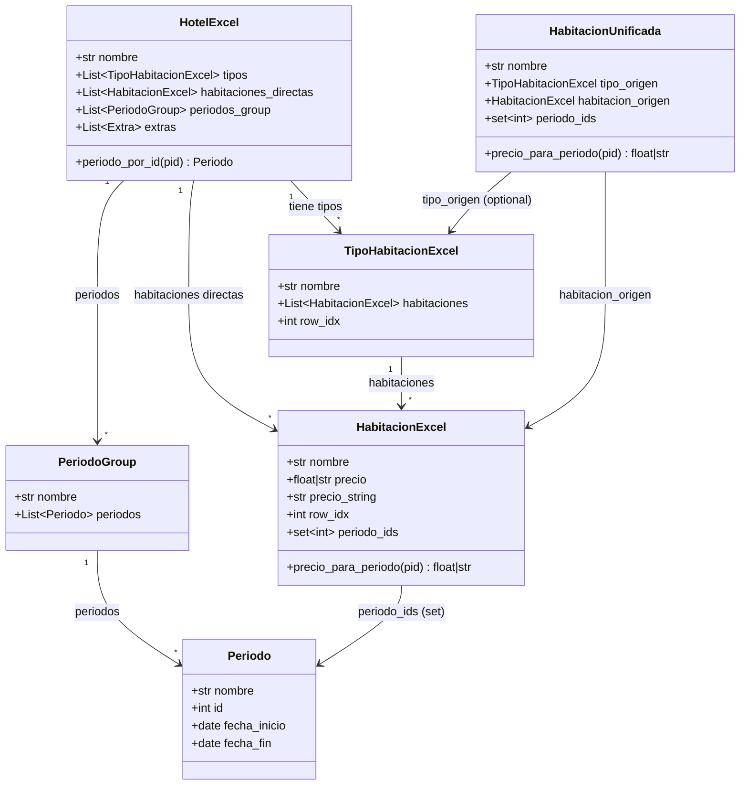
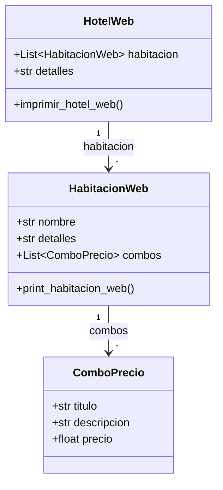

# Modelo de Datos

Este documento detalla todos los modelos Pydantic del proyecto, sus relaciones, validadores y uso.

## Tabla de Contenidos

- [Diagrama de Relaciones](#diagrama-de-relaciones)
- [Modelos Excel](#modelos-excel)
- [Modelos Web](#modelos-web)
- [Modelos de Resultado](#modelos-de-resultado)
- [Validadores Custom](#validadores-custom)

---

## Diagrama de Relaciones

### Modelos Excel



### Modelos Web



---

## Modelos Excel

### Periodo

**Archivo**: [Models/periodo.py](../../Hoteles/Models/periodo.py)

```python
class Periodo(BaseModel):
    """
    Representa un periodo estacional con rango de fechas.

    El ID se auto-incrementa usando variable de clase.
    """
    nombre: Optional[str] = ""
    id: int = Field(init=False)  # No se pasa en __init__
    fecha_inicio: date
    fecha_fin: date

    _contador: ClassVar[int] = 0  # Variable de clase

    def __init__(self, **data):
        """Auto-incrementa el ID."""
        Periodo._contador += 1
        data['id'] = Periodo._contador
        super().__init__(**data)

    @field_validator("fecha_fin")
    @classmethod
    def validar_fechas(cls, v, info):
        """Valida que fecha_fin >= fecha_inicio."""
        if v < info.data["fecha_inicio"]:
            raise ValueError("fecha_fin debe ser >= fecha_inicio")
        return v

    def __str__(self):
        return f"{self.nombre} ({self.fecha_inicio} - {self.fecha_fin})"
```

**Uso**:
```python
periodo = Periodo(
    nombre="low season",
    fecha_inicio=date(2025, 1, 1),
    fecha_fin=date(2025, 3, 31)
)
print(periodo.id)  # 1 (auto-incrementado)
```

---

### PeriodoGroup

**Archivo**: [Models/hotelExcel.py](../../Hoteles/Models/hotelExcel.py)

```python
class PeriodoGroup(BaseModel):
    """
    Agrupa periodos por nombre común.

    Ejemplo: "low season" puede tener múltiples rangos de fechas.
    """
    nombre: str
    periodos: List[Periodo] = Field(default_factory=list)

    def agregar_periodo(self, periodo: Periodo):
        """Agrega un periodo al grupo."""
        self.periodos.append(periodo)

    def __str__(self):
        return f"{self.nombre} ({len(self.periodos)} periodos)"
```

---

### HabitacionExcel

**Archivo**: [Models/hotelExcel.py](../../Hoteles/Models/hotelExcel.py)

```python
class HabitacionExcel(BaseModel):
    """
    Habitación extraída de Excel con precio y periodos asociados.
    """
    nombre: str
    precio: Optional[Union[float, str]] = None  # Puede ser número o leyenda
    precio_string: Optional[str] = None          # Leyenda si aplica
    row_idx: int                                 # Índice de fila en Excel
    periodo_ids: set[int] = Field(default_factory=set)  # IDs de periodos

    @field_validator("nombre", mode="before")
    @classmethod
    def limpiar_nombre(cls, v):
        """Limpia y normaliza el nombre."""
        return str(v).strip().lower()

    @field_validator("precio", mode="before")
    @classmethod
    def procesar_precio(cls, v):
        """
        Valida precio: debe ser número válido o leyenda especial.

        Leyendas permitidas: "closing agreement", "on request", etc.
        """
        if v in ["closing agreement", "on request", "tbc"]:
            return v

        # Normalizar precio numérico
        valor = normalizar_precio_str(v)
        if valor is None:
            raise ValueError(f"Precio inválido: '{v}'")
        return valor

    @model_validator(mode="after")
    def validar_coherencia(self):
        """
        Valida coherencia entre precio y precio_string.

        Si precio es leyenda, guardar en precio_string y poner precio=None.
        """
        if isinstance(self.precio, str):
            self.precio_string = self.precio
            self.precio = None
        return self

    def precio_para_periodo(self, periodo_id: int) -> Optional[Union[float, str]]:
        """
        Retorna precio si el periodo es aplicable a esta habitación.

        Args:
            periodo_id: ID del periodo

        Returns:
            Precio (float) o leyenda (str) si el periodo aplica, None si no
        """
        if periodo_id in self.periodo_ids:
            return self.precio or self.precio_string
        return None

    def __str__(self):
        precio_str = f"${self.precio:.2f}" if isinstance(self.precio, float) else self.precio_string
        return f"{self.nombre} - {precio_str}"
```

**Ejemplo de uso**:
```python
# Precio numérico
hab1 = HabitacionExcel(
    nombre="Double Superior",
    precio=150.0,
    row_idx=10,
    periodo_ids={1, 2, 3}
)

# Precio con leyenda
hab2 = HabitacionExcel(
    nombre="Presidential Suite",
    precio="on request",
    row_idx=15,
    periodo_ids={1}
)

# Validar coherencia
print(hab2.precio)  # None
print(hab2.precio_string)  # "on request"
```

---

### TipoHabitacionExcel

**Archivo**: [Models/hotelExcel.py](../../Hoteles/Models/hotelExcel.py)

```python
class TipoHabitacionExcel(BaseModel):
    """
    Tipo/Edificio que agrupa habitaciones.

    Ejemplo: "Palace Wing", "Garden Wing"
    """
    nombre: str
    habitaciones: List[HabitacionExcel] = Field(default_factory=list)
    row_idx: int

    def agregar_habitacion(self, habitacion: HabitacionExcel):
        """Agrega una habitación al tipo."""
        self.habitaciones.append(habitacion)

    def habitaciones_para_periodo(self, periodo_id: int) -> List[HabitacionExcel]:
        """Retorna habitaciones que tienen el periodo aplicable."""
        return [h for h in self.habitaciones if periodo_id in h.periodo_ids]

    def __str__(self):
        return f"{self.nombre} ({len(self.habitaciones)} habitaciones)"
```

---

### HotelExcel

**Archivo**: [Models/hotelExcel.py](../../Hoteles/Models/hotelExcel.py)

```python
class HotelExcel(BaseModel):
    """
    Hotel completo extraído de Excel.

    Puede tener:
    - tipos (edificios) con habitaciones agrupadas
    - habitaciones_directas (sin agrupar)
    """
    nombre: str
    tipos: List[TipoHabitacionExcel] = Field(default_factory=list)
    habitaciones_directas: List[HabitacionExcel] = Field(default_factory=list)
    periodos_group: List[PeriodoGroup] = Field(default_factory=list)
    extras: list[Extra] = Field(default_factory=list)

    def periodo_por_id(self, pid: int) -> Optional[Periodo]:
        """
        Busca un periodo por ID en todos los grupos.

        Args:
            pid: ID del periodo

        Returns:
            Periodo si se encuentra, None si no
        """
        for grupo in self.periodos_group:
            for periodo in grupo.periodos:
                if periodo.id == pid:
                    return periodo
        return None

    def todas_las_habitaciones(self) -> List[HabitacionExcel]:
        """Retorna todas las habitaciones (de tipos + directas)."""
        habitaciones = []

        # Habitaciones de tipos
        for tipo in self.tipos:
            habitaciones.extend(tipo.habitaciones)

        # Habitaciones directas
        habitaciones.extend(self.habitaciones_directas)

        return habitaciones

    def __str__(self):
        return f"{self.nombre} ({len(self.tipos)} tipos, {len(self.habitaciones_directas)} directas)"
```

---

### HabitacionUnificada

**Archivo**: [Models/hotelExcel.py](../../Hoteles/Models/hotelExcel.py)

```python
class HabitacionUnificada(BaseModel):
    """
    Bridge pattern para unificar habitaciones con/sin tipos.

    Permite tratar todas las habitaciones de forma consistente
    independientemente de si están en un tipo o no.
    """
    nombre: str
    tipo_origen: Optional[TipoHabitacionExcel] = None  # None si es directa
    habitacion_origen: HabitacionExcel
    periodo_ids: set[int] = Field(default_factory=set)

    def precio_para_periodo(self, periodo_id: int) -> Optional[Union[float, str]]:
        """Delega al precio de habitacion_origen."""
        return self.habitacion_origen.precio_para_periodo(periodo_id)

    def __str__(self):
        tipo_str = f" ({self.tipo_origen.nombre})" if self.tipo_origen else ""
        return f"{self.nombre}{tipo_str}"
```

**Uso (en Core/servicio_habitaciones.py)**:
```python
def unificar_habitaciones(habitaciones: List[HabitacionExcel]) -> List[HabitacionUnificada]:
    """Unifica habitaciones con el mismo nombre pero diferentes precios por periodo."""
    unificadas = []

    # Agrupar habitaciones por nombre
    grupos = {}
    for hab in habitaciones:
        nombre_normalizado = hab.nombre.lower().strip()
        if nombre_normalizado not in grupos:
                nombre=hab.nombre,
                tipo_origen=tipo,
                habitacion_origen=hab,
                periodo_ids=hab.periodo_ids
            ))

    # Habitaciones directas
    for hab in hotel.habitaciones_directas:
        unificadas.append(HabitacionUnificada(
            nombre=hab.nombre,
            tipo_origen=None,
            habitacion_origen=hab,
            periodo_ids=hab.periodo_ids
        ))

    return unificadas
```

---

## Modelos Web

### ComboPrecio

**Archivo**: [Models/hotelWeb.py](../../Hoteles/Models/hotelWeb.py)

```python
class ComboPrecio(BaseModel):
    """
    Opción de precio para una habitación web.

    Una habitación puede tener múltiples combos (ej: con/sin breakfast).
    """
    titulo: str
    descripcion: str
    precio: float

    def __str__(self):
        return f"{self.titulo} - ${self.precio:.2f}"
```

---

### HabitacionWeb

**Archivo**: [Models/hotelWeb.py](../../Hoteles/Models/hotelWeb.py)

```python
class HabitacionWeb(BaseModel):
    """Habitación scrapeada de sitio web."""
    nombre: str
    detalles: Optional[str] = None
    combos: List[ComboPrecio] = Field(default_factory=list)

    def precio_minimo(self) -> float:
        """Retorna el precio más barato de los combos."""
        if not self.combos:
            return 0.0
        return min(c.precio for c in self.combos)

    def print_habitacion_web(self):
        """Imprime habitación en formato legible."""
        print(f"\nHabitación: {self.nombre}")
        if self.detalles:
            print(f"Detalles: {self.detalles}")
        print("Combos:")
        for i, combo in enumerate(self.combos, 1):
            print(f"  {i}. {combo.titulo}")
            print(f"     {combo.descripcion}")
            print(f"     💵 ${combo.precio:.2f}")

    def __str__(self):
        return f"{self.nombre} ({len(self.combos)} combos)"
```

---

### HotelWeb

**Archivo**: [Models/hotelWeb.py](../../Hoteles/Models/hotelWeb.py)

```python
class HotelWeb(BaseModel):
    """Hotel completo scrapeado de sitio web."""
    habitacion: List[HabitacionWeb] = Field(default_factory=list, alias="habitacion")
    detalles: str = ""

    def buscar_habitacion(self, nombre: str) -> Optional[HabitacionWeb]:
        """Busca habitación por nombre (case-insensitive, parcial)."""
        nombre_lower = nombre.lower()
        for hab in self.habitacion:
            if nombre_lower in hab.nombre.lower():
                return hab
        return None

    def imprimir_hotel_web(self):
        """Imprime hotel completo en formato legible."""
        print(f"\n{'='*60}")
        print(f"HOTEL WEB - {len(self.habitacion)} habitaciones")
        print(f"{'='*60}")

        for hab in self.habitacion:
            hab.print_habitacion_web()

        print(f"{'='*60}\n")

    def __str__(self):
        return f"HotelWeb ({len(self.habitacion)} habitaciones)"
```

---

## Modelos de Resultado

### ResultadoPeriodo

**Archivo**: [Core/comparador_multiperiodo.py](../../Hoteles/Core/comparador_multiperiodo.py)

```python
class ResultadoPeriodo(BaseModel):
    """Resultado de comparación para un periodo específico."""
    periodo: Periodo
    precio_excel: Union[float, str]  # Puede ser leyenda
    precio_web: float
    diferencia: float
    coincide: bool

    def __str__(self):
        estado = "✅ OK" if self.coincide else "❌ DIFF"
        return f"{self.periodo.nombre}: Excel ${self.precio_excel} vs Web ${self.precio_web} - {estado}"
```

---

### ResultadoComparacionMultiperiodo

**Archivo**: [Core/comparador_multiperiodo.py](../../Hoteles/Core/comparador_multiperiodo.py)

```python
class ResultadoComparacionMultiperiodo(BaseModel):
    """Resultado completo de comparación multi-periodo."""
    habitacion_excel_nombre: str
    habitacion_web_matcheada: HabitacionWeb
    periodos: List[ResultadoPeriodo]
    tiene_discrepancias: bool
    mensaje_match: str

    def periodos_con_discrepancia(self) -> List[ResultadoPeriodo]:
        """Retorna solo periodos con discrepancia."""
        return [p for p in self.periodos if not p.coincide]

    def resumen(self) -> str:
        """Genera resumen textual."""
        total = len(self.periodos)
        discrepancias = len(self.periodos_con_discrepancia())
        return f"{discrepancias}/{total} periodos con discrepancia"

    def __str__(self):
        return f"{self.habitacion_excel_nombre} - {self.resumen()}"
```

---

## Validadores Custom

### @field_validator

Valida campos individuales **antes** de crear la instancia.

```python
@field_validator("precio", mode="before")
@classmethod
def validar_precio(cls, v):
    """Ejecuta ANTES de asignar precio."""
    if isinstance(v, (int, float)) and v < 0:
        raise ValueError("Precio debe ser >= 0")
    return v
```

**Modos**:
- `mode="before"` - Ejecuta antes de conversión de tipo
- `mode="after"` - Ejecuta después de conversión de tipo (default)

---

### @model_validator

Valida **todo el modelo** después de que todos los campos están asignados.

```python
@model_validator(mode="after")
def validar_coherencia(self):
    """Ejecuta DESPUÉS de crear todos los campos."""
    if self.activo and self.precio == 0:
        raise ValueError("Producto activo debe tener precio > 0")
    return self
```

---

## Ejemplos de Uso Completo

### Crear Hotel desde Excel

```python
# Crear periodos
periodo_low = Periodo(
    nombre="low season",
    fecha_inicio=date(2025, 1, 1),
    fecha_fin=date(2025, 3, 31)
)

# Crear habitaciones
hab1 = HabitacionExcel(
    nombre="double superior",
    precio=150.0,
    row_idx=10,
    periodo_ids={periodo_low.id}
)

# Crear tipo
tipo_palace = TipoHabitacionExcel(
    nombre="Palace Wing",
    habitaciones=[hab1],
    row_idx=5
)

# Crear hotel
hotel = HotelExcel(
    nombre="Alvear Palace",
    tipos=[tipo_palace],
    periodos_group=[PeriodoGroup(nombre="low season", periodos=[periodo_low])]
)

# Buscar periodo por ID
periodo = hotel.periodo_por_id(periodo_low.id)
print(periodo)  # low season (2025-01-01 - 2025-03-31)
```

---

Ver también:
- [../desarrollo/convenciones.md](../desarrollo/convenciones.md) - Pattern Modelos Pydantic
- [overview.md](overview.md) - Arquitectura general
- [event-driven-mvc.md](event-driven-mvc.md) - Uso de modelos en MVC