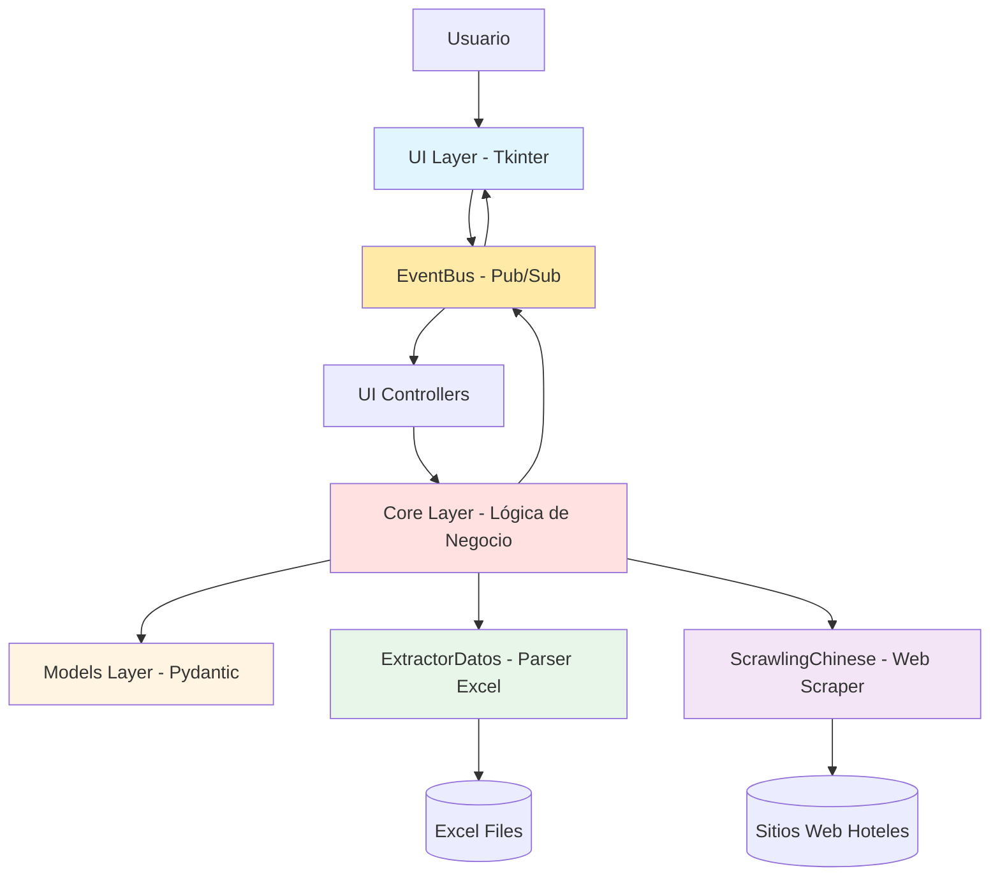

# Arquitectura del Proyecto - Overview

Esta es una visión general de la arquitectura del proyecto **Crawl-Compare** (Comparador de Precios de Hoteles).

## Diagrama de Capas



## Capas Principales

### 1. UI Layer (Tkinter)

**Responsabilidades**:
- Renderizar interfaz gráfica
- Capturar input del usuario
- Mostrar resultados de comparación
- Gestionar estado de la aplicación

**Subdivisiones**:

#### state/ - Gestión de Estado
- **EventBus**: Sistema pub/sub para comunicación desacoplada entre componentes
- **AppState**: Estado centralizado con variables Tkinter (StringVar, IntVar)

#### components/ - Componentes Reutilizables
Todos heredan de `BaseComponent` y deben implementar:
- `_setup_ui()` - Construir interfaz
- `get_value()` - Obtener valor
- `set_value(value)` - Establecer valor
- `reset()` - Resetear a estado inicial (opcional)

Componentes disponibles:
- **DateInputWidget**: Validación de fechas DD-MM-AAAA en tiempo real
- **LabeledComboBox**: Combobox con label estandarizado
- **PeriodosPanel**: Visualización de periodos agrupados
- **PrecioPanel**: Display del precio de habitación (soporta múltiples precios)
- **EntradaEtiquetada**: Entry con label para inputs numéricos/texto

#### views/ - Vistas Compuestas
Agrupan múltiples componentes para formar pantallas completas:
- **FormularioSeleccionHotel**: Selección en cascada (hotel → edificio → habitación)
- **FormularioReserva**: Fechas de entrada/salida + adultos/niños + botón ejecutar
- **VistaResultados**: Tabla comparativa multi-periodo con formato

#### controllers/ - Controladores UI
Lógica de negocio de la UI sin dependencias gráficas directas:
- **ControladorHotel**: Carga hoteles/edificios/habitaciones desde Excel, agrupa por periodos
- **ControladorValidacion**: Validaciones de negocio (fechas, campos completos, orden)
- **ControladorComparacion**: Ejecución asíncrona de comparación (scraping + matching)
- **ControladorPrecios**: Cálculo dinámico de precios según periodos aplicables

#### styles/ - Gestión de Estilos
- **FontManager**: Centraliza las 9 fuentes de la aplicación (normal, negrita, grande, tabla, etc.)

**Archivos clave**:
- [UI/interfaz.py](../../Hoteles/UI/interfaz.py) - InterfazApp principal (1022 líneas)
- [UI/state/event_bus.py](../../Hoteles/UI/state/event_bus.py) - Sistema de eventos
- [UI/state/app_state.py](../../Hoteles/UI/state/app_state.py) - Estado centralizado

---

### 2. Core Layer (Lógica de Negocio)

**Responsabilidades**:
- Orquestar datos entre Excel y Web
- Comparación multi-periodo de precios
- Fuzzy matching de habitaciones
- Generación y envío de emails

**Módulos principales**:

#### controller.py - Fachada de Servicios
Funciones tipo API para acceso desde UI/externos:
- `dar_hoteles_excel()` - Carga datos de Excel
- `dar_hotel_web(force_fresh=False)` - Obtiene datos web con caché
- `comparar_habitaciones()` - Matching fuzzy + comparación de precios
- `generar_texto_email_multiperiodo()` - Genera texto de email con breakdown
  (el envío lo hace `MailtoSender` abriendo el cliente del SO vía `mailto:`)

#### gestor_datos.py - Orquestador de Datos
Clase `GestorDatos` que maneja el flujo entre fuentes Excel y web:
- Carga datos de Excel en la inicialización
- Obtiene datos web de forma asíncrona (con caché vía pickle)
- Gestiona matching entre habitaciones de Excel y web
- Parámetro `force_fresh` para bypass de caché en multi-periodo

#### comparador.py - Fuzzy Matching
Algoritmos de coincidencia difusa usando RapidFuzz:
- `encontrar_mejor_match()` - Matching difuso multi-métrica (4 métricas)
- `obtener_mejor_match_con_breakfast()` - Filtra por inclusión de desayuno
- `limpiar_nombre_excel()` - Normaliza nombres de habitaciones
- **Pesos**: 20% ratio, 30% partial, 25% token_sort, 25% token_set

#### comparador_multiperiodo.py - Comparación Multi-Periodo
Lógica central de comparación multi-periodo (NUEVO):
- Scraping secuencial con delays configurables (evita IP ban)
- Fuzzy matching UNA VEZ (primer periodo), reutilización para subsiguientes
- Error handling robusto con continuación en caso de fallo
- Clases: `ResultadoPeriodo`, `ResultadoComparacionMultiperiodo`

#### servicio_habitaciones.py - Servicio de Habitaciones
Funciones para manejo de habitaciones y periodos:
- `unificar_habitaciones()` - Unifica habitaciones con diferentes variantes de precio
- `inferir_periodos_desde_fechas()` - Detecta periodos aplicables a un rango de fechas
- Cálculo de overlaps entre periodos y reservas

**Archivos clave**:
- [Core/comparador_multiperiodo.py](../../Hoteles/Core/comparador_multiperiodo.py) (230 líneas)
- [Core/controller.py](../../Hoteles/Core/controller.py) - Fachada principal
- [Core/gestor_datos.py](../../Hoteles/Core/gestor_datos.py) - Orquestador

---

### 3. Models Layer (Pydantic)

**Responsabilidades**:
- Validación de datos en tiempo de creación
- Serialización/deserialización automática
- Type safety

**Modelos Excel** (hotelExcel.py):
- **HotelExcel**: Hotel con tipos (edificios) o habitaciones directas
- **TipoHabitacionExcel**: Edificio/tipo que agrupa habitaciones
- **HabitacionExcel**: Habitación con precios y periodos asociados
- **Periodo**: Rango de fechas con ID auto-incremental
- **PeriodoGroup**: Agrupación de periodos por nombre (low season, high season, etc.)
- **HabitacionUnificada**: Bridge pattern para habitaciones con/sin tipos

**Modelos Web** (hotelWeb.py):
- **HotelWeb**: Colección de habitaciones scrapeadas
- **HabitacionWeb**: Habitación con combos de precios
- **ComboPrecio**: Opción de precio (título + descripción + precio)

**Validadores custom**:
- `@field_validator` - Validación por campo individual
- `@model_validator(mode="after")` - Validación global/coherencia

**Archivos clave**:
- [Models/hotelExcel.py](../../Hoteles/Models/hotelExcel.py) - Modelos Excel
- [Models/hotelWeb.py](../../Hoteles/Models/hotelWeb.py) - Modelos Web
- [Models/periodo.py](../../Hoteles/Models/periodo.py) - Modelo Periodo

---

### 4. ExtractorDatos Layer (Parser Excel)

**Responsabilidades**:
- Parsear archivos Excel (openpyxl)
- Extraer hoteles, habitaciones, precios y periodos
- Asignar periodos a habitaciones por proximidad de filas

**Módulos**:

#### extractor.py - Lógica Principal
- Detecta estructura de Excel (con/sin tipos)
- Extrae periodos de patrones regex en filas
- Asigna periodos a habitaciones basándose en proximidad (<3 filas)
- Maneja formatos de fecha complejos: "(1May25 - 30Sep25)", "Easter: 2-5Apr26"

#### utils.py - Funciones Auxiliares
- Parsing de fechas con regex
- Asignación de periodos a habitaciones
- Normalización de precios

**Flujo**:
1. Lee archivo Excel fila por fila
2. Detecta nombres de periodos → crea `Periodo` con ID auto-incremental
3. Detecta habitaciones → crea `HabitacionExcel`
4. Al finalizar hotel, asigna IDs de periodo a habitaciones por proximidad
5. Agrupa periodos en `PeriodoGroup` por nombre

**Archivos clave**:
- [ExtractorDatos/extractor.py](../../Hoteles/ExtractorDatos/extractor.py) - Parser principal
- [ExtractorDatos/utils.py](../../Hoteles/ExtractorDatos/utils.py) - Utilidades

---

### 5. ScrawlingChinese Layer (Web Scraper)

**Responsabilidades**:
- Web crawling asíncrono (Crawl4AI)
- Extracción de datos con LLM (DeepSeek-R1 vía Groq)
- Caché de resultados

**Módulos**:

#### crawler.py - Punto de Entrada
- `crawl_alvear()` - Función asíncrona principal del crawler
- Configura parámetros de búsqueda (fechas, adultos, niños)
- Retorna `HotelWeb` con habitaciones

#### config.py - Configuración
- `BASE_URL` - URL del sitio a scrapear
- `CSS_SELECTOR` - Selector para extraer contenido relevante

#### utils/scraper_utils.py - Utilidades
- Configuración del navegador (headless, wait_until)
- Estrategia LLM (modelo, temperatura, schema Pydantic)
- Procesamiento de resultados
- Lógica de reintentos (máximo 3 intentos)

**Caché**:
- Datos cacheados en `hotel_guardado.pkl`
- Bypass con `force_fresh=True` en comparación multi-periodo

**Archivos clave**:
- [ScrawlingChinese/crawler.py](../../Hoteles/ScrawlingChinese/crawler.py) - Crawler async
- [ScrawlingChinese/config.py](../../Hoteles/ScrawlingChinese/config.py) - Configuración
- [ScrawlingChinese/utils/scraper_utils.py](../../Hoteles/ScrawlingChinese/utils/scraper_utils.py) - Utilidades

---

## Flujo de Datos Simplificado

```
1. Carga Inicial:
   Excel → ExtractorDatos → HotelExcel → AppState

2. Selección Usuario:
   Usuario selecciona hotel/habitación → EventBus → ControladorHotel
   → Carga habitaciones → EventBus → UI actualiza dropdowns

3. Cálculo de Precio:
   Usuario selecciona fechas → ControladorPrecios → Infiere periodos aplicables
   → Calcula precio → EventBus → PrecioPanel muestra precio

4. Comparación:
   Usuario click "Ejecutar" → ControladorComparacion (async thread)
   → comparar_multiperiodo() → Loop por cada periodo:
      → Scraping web (force_fresh=True)
      → Fuzzy matching (solo primer periodo)
      → Comparación precio Excel vs Web
      → Delay 2s
   → ResultadoComparacionMultiperiodo → EventBus
   → VistaResultados muestra tabla comparativa

5. Email (opcional):
   Si hay discrepancias → Usuario click "Enviar email"
   → generar_texto_email_multiperiodo() → MailtoSender → cliente de email del SO
```

## Patrones de Diseño Utilizados

### Event-Driven Architecture
- **EventBus** (pub/sub) desacopla componentes UI de lógica de negocio
- Permite reactividad: cambios en estado → eventos → UI actualiza

### MVC (Model-View-Controller)
- **Models**: Pydantic (HotelExcel, HotelWeb)
- **Views**: Componentes Tkinter (FormularioSeleccionHotel, VistaResultados)
- **Controllers**: Controladores UI (ControladorHotel, ControladorComparacion)

### Strategy Pattern
- Fuzzy matching con múltiples métricas combinadas (ratio, partial, token_sort, token_set)
- LLM extraction strategy configurable (modelo, temperatura)

### Bridge Pattern
- `HabitacionUnificada` abstrae diferencia entre habitaciones con/sin tipos

### Template Method
- `BaseComponent` define template (`__init__` → `_setup_ui()` → `_bind_events()`)
- Subclases implementan pasos específicos

### Observer Pattern
- EventBus implementa observer para notificar cambios de estado

## Dependencias Entre Capas

```
UI → Core → Models
UI → Core → ExtractorDatos → Models
UI → Core → ScrawlingChinese → Models

EventBus ← UI
EventBus → Controllers → Core
EventBus ← Core
```

**Reglas**:
- UI nunca accede directamente a ExtractorDatos o ScrawlingChinese
- Core orquesta todo el flujo de datos
- Models es compartido por todas las capas
- EventBus es el bus de comunicación único

## Performance Considerations

- **Scraping asíncrono** (asyncio + aiohttp) → no bloquea thread principal
- **Background threads** para comparación → UI responsive
- **Caché de datos web** → evita scraping redundante
- **Fuzzy matching optimizado** (RapidFuzz en C) → subsegundo
- **Delays entre requests** → evita rate limiting y IP ban

## Seguridad

- Credentials en variables de entorno (`.env`)
- Caché NO guarda datos sensibles (solo públicos del sitio web)
- Scraping respeta delays para no sobrecargar servidor
- Email usa TLS (puerto 587)

---

Ver más detalles en:
- [event-driven-mvc.md](event-driven-mvc.md) - Arquitectura EventBus + MVC
- [flujos-principales.md](flujos-principales.md) - Diagramas de flujos completos
- [modelo-datos.md](modelo-datos.md) - Modelos Pydantic en detalle
