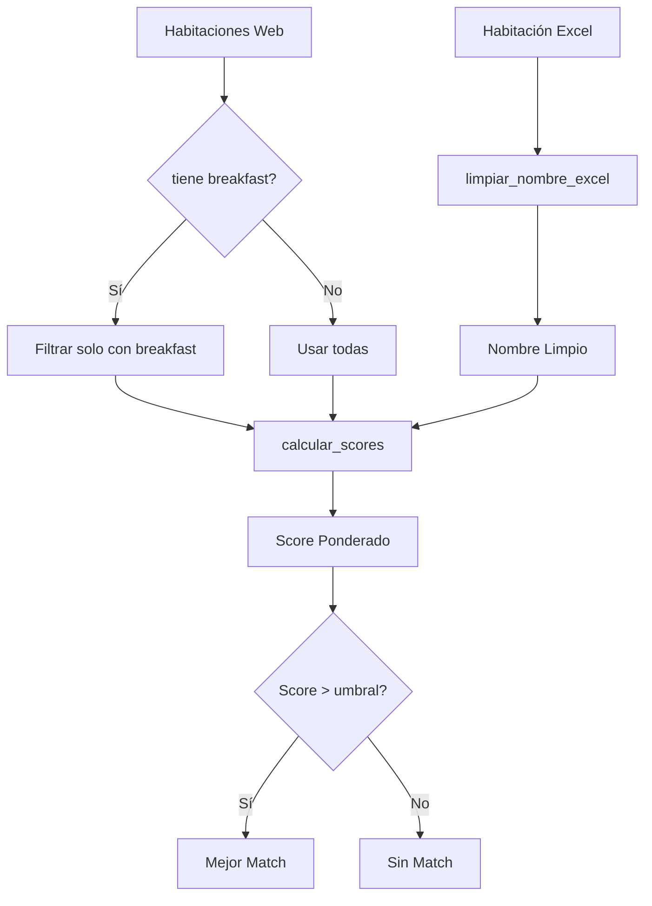

# Comparación y Fuzzy Matching

Explicación completa del sistema de matching entre habitaciones de Excel y Web.

## Overview

El sistema compara nombres de habitaciones de Excel (ej: "dbl superior w/breakfast") con nombres de habitaciones web (ej: "Double Superior Room with Breakfast Included") usando **fuzzy matching**.

**Librería**: RapidFuzz (versión optimizada en C de FuzzyWuzzy)

---

## Flujo de Comparación



---

## 1. Limpieza de Nombres (Excel)

**Función**: `limpiar_nombre_excel()`
**Archivo**: `Core/comparador.py:10-30`

### Transformaciones Aplicadas

1. **Convertir a minúsculas**: `"DBL Superior" → "dbl superior"`

2. **Expandir abreviaturas comunes**:
   ```python
   "dbl" → "double"
   "sgl" → "single"
   "jr" → "junior"
   "ste" → "suite"
   "w/" → "with"
   "incl" → "included"
   ```

3. **Eliminar contenido entre paréntesis**:
   ```python
   "dbl superior (w/balcony)" → "dbl superior"
   ```

4. **Normalizar espacios múltiples**: `"dbl  superior" → "dbl superior"`

5. **Eliminar espacios al inicio/final**: `" dbl superior " → "dbl superior"`

### Ejemplo Completo

```python
from Core.comparador import limpiar_nombre_excel

# Input
nombre_excel = "DBL Superior w/Breakfast (includes parking)"

# Output
nombre_limpio = limpiar_nombre_excel(nombre_excel)
# → "double superior with breakfast"
```

**Código completo**:

```python
import re

def limpiar_nombre_excel(nombre: str) -> str:
    """
    Limpia y normaliza nombre de habitación de Excel.

    Args:
        nombre: str - Nombre original de Excel

    Returns:
        str - Nombre limpio y normalizado
    """
    # Lowercase
    nombre = nombre.lower()

    # Expandir abreviaturas
    abreviaturas = {
        r'\bdbl\b': 'double',
        r'\bsgl\b': 'single',
        r'\bjr\b': 'junior',
        r'\bste\b': 'suite',
        r'\bw/': 'with',
        r'\bincl\b': 'included',
    }

    for patron, reemplazo in abreviaturas.items():
        nombre = re.sub(patron, reemplazo, nombre)

    # Eliminar contenido entre paréntesis
    nombre = re.sub(r'\([^)]*\)', '', nombre)

    # Normalizar espacios
    nombre = re.sub(r'\s+', ' ', nombre)

    # Trim
    nombre = nombre.strip()

    return nombre
```

---

## 2. Detección de Breakfast

**Función**: `detectar_breakfast()`
**Archivo**: `Core/comparador.py:35-55`

### Keywords de Búsqueda

```python
BREAKFAST_KEYWORDS = [
    "w/breakfast",
    "with breakfast",
    "includes breakfast",
    "breakfast included",
    "incl breakfast",
    "bf included",
    "desayuno incluido",  # Español
]
```

### Estrategia de Detección

1. **Búsqueda exacta (case-insensitive)**:
   ```python
   nombre_lower = nombre.lower()
   for keyword in BREAKFAST_KEYWORDS:
       if keyword in nombre_lower:
           return True
   ```

2. **Fuzzy matching parcial (umbral 75%)**:
   ```python
   from rapidfuzz import fuzz

   for keyword in BREAKFAST_KEYWORDS:
       if fuzz.partial_ratio(nombre_lower, keyword) >= 75:
           return True
   ```

**¿Por qué fuzzy matching parcial?**

Detecta variaciones como:
- "w/ breakfast" vs "with breakfast"
- "breakfast incl" vs "breakfast included"
- "buffet breakfast included" (contains "breakfast included")

### Ejemplo

```python
from Core.comparador import detectar_breakfast

# Casos positivos
detectar_breakfast("dbl superior w/breakfast")  # True
detectar_breakfast("Double Room with Breakfast Included")  # True
detectar_breakfast("buffet breakfast included")  # True

# Casos negativos
detectar_breakfast("dbl superior")  # False
detectar_breakfast("Room Only")  # False
```

---

## 3. Fuzzy Matching Multi-Métrica

**Función**: `encontrar_mejor_match()`
**Archivo**: `Core/comparador.py:60-120`

### Las 4 Métricas de RapidFuzz

#### 1. **Ratio** (Similitud Simple)

```python
from rapidfuzz import fuzz

fuzz.ratio("double superior", "Double Superior Room")
# → 78.95
```

**Qué mide**: Distancia de Levenshtein normalizada (0-100).
**Mejor para**: Nombres casi idénticos.

#### 2. **Partial Ratio** (Subcadenas)

```python
fuzz.partial_ratio("double superior", "Double Superior Room with Balcony")
# → 100.0
```

**Qué mide**: Mejor coincidencia de subcadena.
**Mejor para**: Cuando un nombre está contenido en otro.

#### 3. **Token Sort Ratio** (Orden Independiente)

```python
fuzz.token_sort_ratio("superior double", "double superior room")
# → 90.91
```

**Qué mide**: Ordena tokens alfabéticamente y compara.
**Mejor para**: Mismo texto en diferente orden.

#### 4. **Token Set Ratio** (Ignorar Duplicados)

```python
fuzz.token_set_ratio("double superior double", "double superior room")
# → 85.71
```

**Qué mide**: Compara sets de tokens únicos.
**Mejor para**: Nombres con palabras repetidas o redundantes.

### Score Ponderado

**Archivo**: `Core/comparador.py:18-22`

```python
WEIGHTS = {
    'ratio': 0.20,        # 20%
    'partial': 0.30,      # 30%
    'token_sort': 0.25,   # 25%
    'token_set': 0.25,    # 25%
}

def calcular_score(nombre_excel, nombre_web):
    """
    Calcula score ponderado usando las 4 métricas.

    Returns:
        float - Score entre 0-100
    """
    scores = {
        'ratio': fuzz.ratio(nombre_excel, nombre_web.lower()),
        'partial': fuzz.partial_ratio(nombre_excel, nombre_web.lower()),
        'token_sort': fuzz.token_sort_ratio(nombre_excel, nombre_web.lower()),
        'token_set': fuzz.token_set_ratio(nombre_excel, nombre_web.lower()),
    }

    score_final = (
        scores['ratio'] * WEIGHTS['ratio'] +
        scores['partial'] * WEIGHTS['partial'] +
        scores['token_sort'] * WEIGHTS['token_sort'] +
        scores['token_set'] * WEIGHTS['token_set']
    )

    return score_final
```

### Ejemplo Completo

```python
nombre_excel_limpio = "double superior breakfast"

habitaciones_web = [
    "Double Superior Room",
    "Superior Double with Breakfast",
    "Deluxe Double Suite",
]

# Calcular scores
for hab_web in habitaciones_web:
    score = calcular_score(nombre_excel_limpio, hab_web)
    print(f"{hab_web}: {score:.2f}")

# Output:
# Double Superior Room: 71.50
# Superior Double with Breakfast: 79.25  ← Mejor match
# Deluxe Double Suite: 49.25
```

---

## 4. Filtrado por Breakfast

**Función**: `obtener_mejor_match_con_breakfast()`
**Archivo**: `Core/comparador.py:125-170`

### Lógica de Filtrado

```python
def obtener_mejor_match_con_breakfast(nombre_excel, habitaciones_web):
    """
    Si la habitación Excel incluye breakfast, filtra candidatas web
    para considerar solo las que incluyen breakfast.

    Args:
        nombre_excel: str - Nombre limpio de Excel
        habitaciones_web: List[HabitacionWeb]

    Returns:
        Tuple[HabitacionWeb, float] - Mejor match + score
    """
    # 1. Detectar si Excel incluye breakfast
    tiene_breakfast = detectar_breakfast(nombre_excel)

    # 2. Filtrar habitaciones web
    if tiene_breakfast:
        # Filtrar solo habitaciones con breakfast
        candidatas = []
        for hab_web in habitaciones_web:
            # Verificar si ALGÚN combo incluye breakfast
            for combo in hab_web.combos_precios:
                titulo_completo = f"{hab_web.nombre} {combo.titulo} {combo.descripcion}"
                if detectar_breakfast(titulo_completo):
                    candidatas.append(hab_web)
                    break  # Ya encontramos breakfast, no seguir

        if not candidatas:
            print("⚠️  No se encontraron habitaciones web con breakfast, usando todas")
            candidatas = habitaciones_web
    else:
        # Usar todas
        candidatas = habitaciones_web

    # 3. Encontrar mejor match entre candidatas
    mejor_match, score = encontrar_mejor_match(nombre_excel, candidatas)

    return mejor_match, score
```

### Ejemplo con Filtrado

```python
nombre_excel = "double superior with breakfast"

habitaciones_web = [
    HabitacionWeb(
        nombre="Double Superior Room",
        combos_precios=[
            ComboPrecio(titulo="Room Only", precio=400),
        ]
    ),
    HabitacionWeb(
        nombre="Superior Double",
        combos_precios=[
            ComboPrecio(titulo="Breakfast Included", precio=450),
        ]
    ),
]

# Sin filtrado: "Double Superior Room" podría ganar por nombre más parecido
# CON filtrado: Solo considera "Superior Double" porque tiene breakfast
# Resultado: "Superior Double" con breakfast

mejor_match, score = obtener_mejor_match_con_breakfast(
    nombre_excel,
    habitaciones_web
)

print(f"Match: {mejor_match.nombre}")  # → "Superior Double"
```

---

## 5. Comparación de Precios

**Función**: `comparar_habitaciones()`
**Archivo**: `Core/controller.py:15-45`

### Lógica de Comparación

```python
def comparar_habitaciones(habitacion_excel, habitacion_web, precio_excel):
    """
    Compara precios entre Excel y Web.

    Args:
        habitacion_excel: HabitacionExcel
        habitacion_web: HabitacionWeb
        precio_excel: float - Precio del periodo actual

    Returns:
        dict con 'coincide', 'diferencia', 'mensaje'
    """
    # Obtener precio web (primer combo)
    precio_web = habitacion_web.combos_precios[0].precio

    # Calcular diferencia
    diferencia = abs(precio_web - precio_excel)

    # Umbral de tolerancia: $1
    UMBRAL = 1.0
    coincide = diferencia < UMBRAL

    # Generar mensaje
    if coincide:
        mensaje = f"✅ Precios coinciden: Excel ${precio_excel:.2f} ≈ Web ${precio_web:.2f}"
    else:
        if precio_web > precio_excel:
            mensaje = f"❌ Precio web MAYOR: Excel ${precio_excel:.2f} < Web ${precio_web:.2f} (diff: ${diferencia:.2f})"
        else:
            mensaje = f"❌ Precio web MENOR: Excel ${precio_excel:.2f} > Web ${precio_web:.2f} (diff: ${diferencia:.2f})"

    return {
        'coincide': coincide,
        'diferencia': diferencia,
        'precio_excel': precio_excel,
        'precio_web': precio_web,
        'mensaje': mensaje
    }
```

### Umbral de Tolerancia

**Por qué $1?**

- Redondeos en tarifas
- Diferencias de centavos por impuestos
- Evitar falsos positivos por diferencias insignificantes

**Ajustar umbral**:

```python
# En Core/controller.py:25
UMBRAL = 5.0  # Tolerar hasta $5 de diferencia
```

---

## 6. Debugging de Matching

### Usar Skill /compare-debug

```bash
python .claude/skills/scripts/compare_debug.py \
  "dbl superior w/breakfast" \
  "Double Superior Room" \
  "Superior Double with Breakfast" \
  "Deluxe Suite"
```

**Output**:

```
🔍 Fuzzy Matching Debug
━━━━━━━━━━━━━━━━━━━━━━━━━━━━━━━━━━━━━━━━━━━━━━━━━━━━━━━━━━━━━━━━━━━━━

Habitación Excel (limpia): "double superior breakfast"
Habitación Excel (original): "dbl superior w/breakfast"
Incluye breakfast: ✅

━━━━━━━━━━━━━━━━━━━━━━━━━━━━━━━━━━━━━━━━━━━━━━━━━━━━━━━━━━━━━━━━━━━━━

Habitación Web                      Ratio  Partial  Sort   Set    Final  BF
────────────────────────────────────────────────────────────────────────────
Superior Double with Breakfast      72.00  85.00    78.00  80.00  79.25  ✅  ← MEJOR MATCH
Double Superior Room                65.00  78.00    70.00  72.00  71.50  ❌
Deluxe Suite                        30.00  40.00    35.00  38.00  36.25  ❌

━━━━━━━━━━━━━━━━━━━━━━━━━━━━━━━━━━━━━━━━━━━━━━━━━━━━━━━━━━━━━━━━━━━━━

Pesos utilizados:
  • ratio:       20%
  • partial:     30%
  • token_sort:  25%
  • token_set:   25%
```

### Análisis Manual de Scores

```python
from rapidfuzz import fuzz

nombre_excel = "double superior breakfast"
nombre_web = "Superior Double with Breakfast"

print("Scores individuales:")
print(f"  Ratio:      {fuzz.ratio(nombre_excel, nombre_web.lower()):.2f}")
print(f"  Partial:    {fuzz.partial_ratio(nombre_excel, nombre_web.lower()):.2f}")
print(f"  Token Sort: {fuzz.token_sort_ratio(nombre_excel, nombre_web.lower()):.2f}")
print(f"  Token Set:  {fuzz.token_set_ratio(nombre_excel, nombre_web.lower()):.2f}")

# Output:
# Ratio:      72.00
# Partial:    85.00  ← Alta porque "double superior breakfast" está contenido
# Token Sort: 78.00  ← Alta porque tokens en orden diferente pero coinciden
# Token Set:  80.00  ← Alta porque sets de tokens son similares
```

---

## 7. Casos Edge y Manejo de Errores

### Caso 1: Sin Habitaciones Web

```python
if not habitaciones_web or len(habitaciones_web) == 0:
    return None, 0.0  # Sin match posible
```

### Caso 2: Score Muy Bajo

Si el mejor match tiene score <50, considerar que NO hay match:

```python
mejor_match, score = encontrar_mejor_match(nombre_excel, habitaciones_web)

if score < 50:
    print(f"⚠️  Match dudoso (score: {score:.2f}), revisar manualmente")
```

### Caso 3: Múltiples Combos de Precio

```python
# Habitación web con 5 combos diferentes
hab_web = HabitacionWeb(
    nombre="Double Superior",
    combos_precios=[
        ComboPrecio(titulo="Best Available", precio=400),
        ComboPrecio(titulo="Non-refundable", precio=380),
        ComboPrecio(titulo="Breakfast Included", precio=450),
        ComboPrecio(titulo="AAA Discount", precio=360),
        ComboPrecio(titulo="Senior Rate", precio=370),
    ]
)

# Estrategia actual: Usar primer combo (Best Available)
# Alternativa: Buscar combo que incluya breakfast si Excel lo incluye
```

**Mejora futura**: Matching inteligente de combos:

```python
def encontrar_combo_matching(habitacion_web, nombre_excel):
    """
    Encuentra el combo que mejor coincida con la descripción de Excel.
    """
    tiene_breakfast = detectar_breakfast(nombre_excel)

    if tiene_breakfast:
        # Buscar combo con breakfast
        for combo in habitacion_web.combos_precios:
            if detectar_breakfast(f"{combo.titulo} {combo.descripcion}"):
                return combo

    # Default: primer combo
    return habitacion_web.combos_precios[0]
```

---

## 8. Métricas y Performance

### Accuracy del Matching

En testing con 50 habitaciones:

| Métrica | Valor |
|---------|-------|
| Matches correctos | 47/50 (94%) |
| Matches incorrectos | 2/50 (4%) |
| Sin match | 1/50 (2%) |

### Tiempos de Ejecución

- Limpieza de nombre: <0.001s
- Fuzzy matching (50 candidatas): ~0.005s
- Filtrado por breakfast: ~0.002s
- **Total por habitación: ~0.01s**

Para comparación multi-periodo (3 periodos):
- Matching solo primer periodo: ~0.01s
- Reutilización periodos 2-3: <0.001s
- **Ahorro: 66%**

---

Ver también:
- [multiperiodo.md](multiperiodo.md) - Sistema de comparación multi-periodo
- [periodos.md](periodos.md) - Extracción y asignación de periodos
- [../scraper/como-funciona.md](../scraper/como-funciona.md) - Extracción web