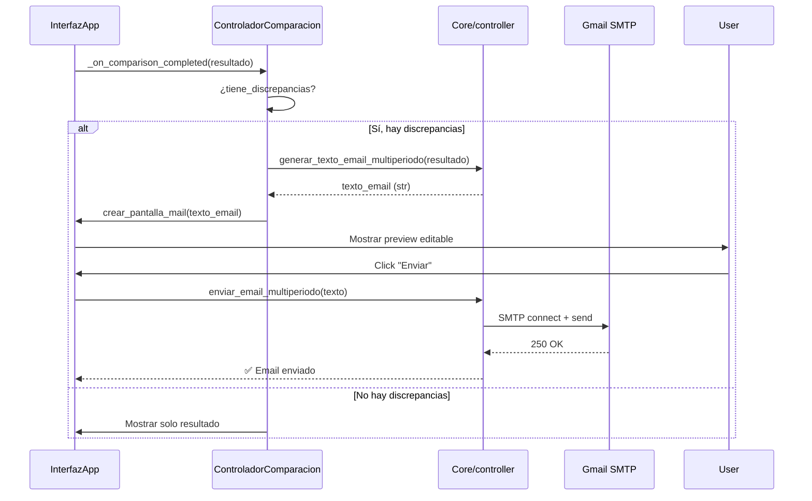

# Sistema de Email

Explicación completa del sistema de notificaciones por email.

## Overview

El sistema envía emails automáticos cuando detecta discrepancias de precio entre Excel y Web.

**Protocolo**: SMTP vía Gmail (TLS puerto 587)
**Librería**: `smtplib` (Python stdlib)

---

## Configuración

### Variables de Entorno

**Archivo**: `Hoteles/.env`

```env
# Contraseña de aplicación de Gmail
GMTP_KEY=tu_contraseña_de_aplicacion_aqui

# Email remitente (debe coincidir con la cuenta de GMTP_KEY)
SMTP_USER=tu_email@gmail.com

# Email destinatario
EMAIL_TO=destinatario@example.com
```

### Obtener Contraseña de Aplicación de Gmail

1. Ir a [myaccount.google.com/security](https://myaccount.google.com/security)
2. Activar "Verificación en 2 pasos" (si no está activada)
3. Navegar a "Contraseñas de aplicación"
4. Seleccionar:
   - Aplicación: "Mail"
   - Dispositivo: "Windows Computer" (o el que uses)
5. Copiar la contraseña de 16 caracteres generada
6. Pegar en `.env` como `GMTP_KEY`

**IMPORTANTE**: NO usar la contraseña normal de Gmail. Usar contraseña de aplicación.

---

## Flujo de Envío



---

## Generación de Texto

### Para Comparación Single (Legacy)

**Función**: `generar_texto_email()`
**Archivo**: `Core/controller.py:50-70`

```python
def generar_texto_email(
    habitacion_excel_nombre,
    habitacion_web_matcheada,
    precio_excel,
    precio_web,
    diferencia
):
    """
    Genera texto de email para comparación simple.

    Args:
        habitacion_excel_nombre: str
        habitacion_web_matcheada: HabitacionWeb
        precio_excel: float
        precio_web: float
        diferencia: float

    Returns:
        str - Texto formateado del email
    """
    texto = f"""
DISCREPANCIA DE PRECIO DETECTADA

Habitación (Excel): {habitacion_excel_nombre}
Habitación (Web):   {habitacion_web_matcheada.nombre}

Precio Excel: ${precio_excel:.2f}
Precio Web:   ${precio_web:.2f}
Diferencia:   ${diferencia:.2f}

Verificar y actualizar tarifas según corresponda.

---
Este email fue generado automáticamente por el sistema de comparación de precios.
"""
    return texto
```

### Para Comparación Multi-Periodo

**Función**: `generar_texto_email_multiperiodo()`
**Archivo**: `Core/controller.py:75-150`

```python
def generar_texto_email_multiperiodo(resultado: ResultadoComparacionMultiperiodo):
    """
    Genera texto de email con tabla de todos los periodos.

    Args:
        resultado: ResultadoComparacionMultiperiodo

    Returns:
        str - Texto formateado con tabla ASCII
    """
    lineas = []

    # Header
    lineas.append("=" * 80)
    lineas.append("DISCREPANCIAS DE PRECIO DETECTADAS - COMPARACIÓN MULTI-PERIODO")
    lineas.append("=" * 80)
    lineas.append("")

    # Info de habitación
    lineas.append(f"Habitación (Excel): {resultado.habitacion_excel_nombre}")
    lineas.append(f"Habitación (Web):   {resultado.habitacion_web_matcheada.nombre}")
    lineas.append(f"Match: {resultado.mensaje_match}")
    lineas.append("")

    # Tabla de periodos
    lineas.append("-" * 80)
    lineas.append(f"{'PERIODO':<25} {'EXCEL':>12} {'WEB':>12} {'DIFERENCIA':>12} {'STATUS':>10}")
    lineas.append("-" * 80)

    for resultado_periodo in resultado.periodos:
        periodo_nombre = resultado_periodo.periodo.nombre[:24]  # Truncar si es muy largo
        precio_excel_str = f"${resultado_periodo.precio_excel:.2f}" if isinstance(resultado_periodo.precio_excel, (int, float)) else resultado_periodo.precio_excel
        precio_web_str = f"${resultado_periodo.precio_web:.2f}"
        diferencia_str = f"${resultado_periodo.diferencia:.2f}"
        status = "OK" if resultado_periodo.coincide else "DIFF"

        linea = f"{periodo_nombre:<25} {precio_excel_str:>12} {precio_web_str:>12} {diferencia_str:>12} {status:>10}"
        lineas.append(linea)

    lineas.append("-" * 80)
    lineas.append("")

    # Resumen
    total_periodos = len(resultado.periodos)
    con_discrepancias = sum(1 for r in resultado.periodos if not r.coincide)
    lineas.append(f"Total periodos evaluados:  {total_periodos}")
    lineas.append(f"Periodos con discrepancia: {con_discrepancias}")
    lineas.append("")

    # Footer
    lineas.append("Verificar y actualizar tarifas según corresponda.")
    lineas.append("")
    lineas.append("---")
    lineas.append("Este email fue generado automáticamente por el sistema de comparación de precios.")

    return '\n'.join(lineas)
```

### Ejemplo de Email Multi-Periodo

```
================================================================================
DISCREPANCIAS DE PRECIO DETECTADAS - COMPARACIÓN MULTI-PERIODO
================================================================================

Habitación (Excel): dbl superior w/breakfast
Habitación (Web):   Double Superior Room with Breakfast
Match: Match encontrado: Double Superior Room with Breakfast (score: 85.50)

--------------------------------------------------------------------------------
PERIODO                      EXCEL          WEB   DIFERENCIA     STATUS
--------------------------------------------------------------------------------
low season                $450.00     $455.00        $5.00       DIFF
high season               $680.00     $680.00        $0.00         OK
easter                    $720.00     $750.00       $30.00       DIFF
--------------------------------------------------------------------------------

Total periodos evaluados:  3
Periodos con discrepancia: 2

Verificar y actualizar tarifas según corresponda.

---
Este email fue generado automáticamente por el sistema de comparación de precios.
```

---

## Envío de Email

### Función Principal

**Función**: `enviar_email_multiperiodo()`
**Archivo**: `Core/controller.py:155-210`

```python
import smtplib
from email.mime.text import MIMEText
from email.mime.multipart import MIMEMultipart
import os

def enviar_email_multiperiodo(texto_email, asunto="Discrepancia de Precio - Multi-Periodo"):
    """
    Envía email vía Gmail SMTP.

    Args:
        texto_email: str - Cuerpo del email
        asunto: str - Asunto del email

    Returns:
        bool - True si envío exitoso, False si falla

    Raises:
        Exception si falta configuración o falla SMTP
    """
    # Cargar credenciales
    smtp_user = os.getenv('SMTP_USER')
    smtp_password = os.getenv('GMTP_KEY')
    email_to = os.getenv('EMAIL_TO')

    if not smtp_password:
        raise Exception("GMTP_KEY no configurado en .env")

    if not smtp_user:
        raise Exception("SMTP_USER no configurado en .env")

    if not email_to:
        raise Exception("EMAIL_TO no configurado en .env")

    # Construir mensaje
    msg = MIMEMultipart()
    msg['From'] = smtp_user
    msg['To'] = email_to
    msg['Subject'] = asunto

    # Agregar cuerpo
    msg.attach(MIMEText(texto_email, 'plain', 'utf-8'))

    # Conectar a Gmail SMTP
    try:
        print(f"📧 Conectando a Gmail SMTP...")

        server = smtplib.SMTP('smtp.gmail.com', 587)
        server.starttls()  # Iniciar TLS
        server.login(smtp_user, smtp_password)

        print(f"📧 Enviando email a {email_to}...")

        # Enviar
        server.send_message(msg)
        server.quit()

        print(f"✅ Email enviado exitosamente")
        return True

    except smtplib.SMTPAuthenticationError:
        print(f"❌ Error de autenticación: Verificar GMTP_KEY")
        raise

    except smtplib.SMTPException as e:
        print(f"❌ Error SMTP: {e}")
        raise

    except Exception as e:
        print(f"❌ Error inesperado: {e}")
        raise
```

### Configuración SMTP

**Servidor**: `smtp.gmail.com`
**Puerto**: `587`
**Protocolo**: TLS (Transport Layer Security)
**Autenticación**: LOGIN

**Alternativas** (si Gmail no funciona):

```python
# Outlook/Hotmail
server = smtplib.SMTP('smtp-mail.outlook.com', 587)

# Yahoo
server = smtplib.SMTP('smtp.mail.yahoo.com', 587)

# SMTP genérico
server = smtplib.SMTP('smtp.example.com', 587)
```

---

## Preview y Edición en UI

### Modal de Email

**Función**: `crear_pantalla_mail()`
**Archivo**: `UI/interfaz.py:450-550`

```python
def crear_pantalla_mail(self, texto_email):
    """
    Crea ventana modal para preview y edición de email.

    Args:
        texto_email: str - Texto generado del email
    """
    ventana = tk.Toplevel(self.root)
    ventana.title("Enviar Email - Discrepancia de Precio")
    ventana.geometry("800x600")

    # Frame principal
    frame = tk.Frame(ventana, padx=20, pady=20)
    frame.pack(fill=tk.BOTH, expand=True)

    # Label
    label = tk.Label(
        frame,
        text="Preview del email (editable):",
        font=("Arial", 12, "bold")
    )
    label.pack(anchor=tk.W, pady=(0, 10))

    # Text widget con scrollbar
    text_frame = tk.Frame(frame)
    text_frame.pack(fill=tk.BOTH, expand=True)

    scrollbar = tk.Scrollbar(text_frame)
    scrollbar.pack(side=tk.RIGHT, fill=tk.Y)

    text_widget = tk.Text(
        text_frame,
        wrap=tk.WORD,
        font=("Courier New", 10),
        yscrollcommand=scrollbar.set
    )
    text_widget.pack(side=tk.LEFT, fill=tk.BOTH, expand=True)
    scrollbar.config(command=text_widget.yview)

    # Insertar texto
    text_widget.insert('1.0', texto_email)

    # Botones
    button_frame = tk.Frame(frame)
    button_frame.pack(pady=(10, 0))

    def enviar_email():
        # Obtener texto editado
        texto_final = text_widget.get('1.0', tk.END).strip()

        try:
            from Core.controller import enviar_email_multiperiodo
            enviar_email_multiperiodo(texto_final)

            messagebox.showinfo("Éxito", "Email enviado correctamente")
            ventana.destroy()

        except Exception as e:
            messagebox.showerror("Error", f"No se pudo enviar el email:\n{str(e)}")

    btn_enviar = tk.Button(
        button_frame,
        text="Enviar Email",
        command=enviar_email,
        bg="#4CAF50",
        fg="white",
        font=("Arial", 11, "bold"),
        padx=20,
        pady=10
    )
    btn_enviar.pack(side=tk.LEFT, padx=5)

    btn_cancelar = tk.Button(
        button_frame,
        text="Cancelar",
        command=ventana.destroy,
        bg="#f44336",
        fg="white",
        font=("Arial", 11, "bold"),
        padx=20,
        pady=10
    )
    btn_cancelar.pack(side=tk.LEFT, padx=5)
```

**Flujo**:
1. Usuario ejecuta comparación
2. Sistema detecta discrepancias
3. Genera texto de email
4. Abre modal con preview editable
5. Usuario puede modificar texto
6. Usuario click "Enviar Email"
7. Sistema envía via SMTP
8. Muestra confirmación

---

## Troubleshooting

### Error: "SMTPAuthenticationError: Username and Password not accepted"

**Causa**: Contraseña incorrecta o no es contraseña de aplicación

**Solución**:
1. Verificar que `GMTP_KEY` en `.env` es contraseña de aplicación (16 chars)
2. Generar nueva contraseña de aplicación
3. Verificar que `SMTP_USER` coincide con la cuenta de Google usada

### Error: "SMTPServerDisconnected: Connection unexpectedly closed"

**Causa**: Gmail bloqueó la conexión (menos común con contraseñas de app)

**Solución**:
1. Verificar que "Verificación en 2 pasos" está activada
2. Ir a [myaccount.google.com/lesssecureapps](https://myaccount.google.com/lesssecureapps) y habilitar acceso
3. Usar contraseña de aplicación (no contraseña normal)

### Error: "SMTP timeout"

**Causa**: Firewall o red bloquea puerto 587

**Solución**:
1. Verificar firewall permite conexiones salientes a `smtp.gmail.com:587`
2. Intentar con puerto alternativo: 465 (SSL en vez de TLS)
   ```python
   server = smtplib.SMTP_SSL('smtp.gmail.com', 465)
   # No usar starttls() con SMTP_SSL
   ```

### Error: "EMAIL_TO not configured"

**Causa**: Falta variable de entorno

**Solución**: Agregar `EMAIL_TO` a `.env`:
```env
EMAIL_TO=destinatario@example.com
```

---

## Testing sin Envío Real

### Mock de Envío

**Crear archivo**: `Tests/test_email.py`

```python
def test_generar_email_multiperiodo():
    """
    Testea generación de email sin enviarlo.
    """
    from Core.controller import generar_texto_email_multiperiodo
    from Models.hotelExcel import Periodo
    from Core.comparador_multiperiodo import ResultadoComparacionMultiperiodo, ResultadoPeriodo

    # Mock de resultado
    resultado = ResultadoComparacionMultiperiodo(
        habitacion_excel_nombre="dbl superior w/breakfast",
        habitacion_web_matcheada=HabitacionWeb(...),
        periodos=[
            ResultadoPeriodo(
                periodo=Periodo(nombre="low season", fecha_inicio="01-05-2025", fecha_fin="30-09-2025"),
                precio_excel=450.0,
                precio_web=455.0,
                diferencia=5.0,
                coincide=False
            ),
        ],
        mensaje_match="Match: 85.50"
    )

    # Generar texto
    texto = generar_texto_email_multiperiodo(resultado)

    # Verificar contenido
    assert "DISCREPANCIAS DE PRECIO DETECTADAS" in texto
    assert "dbl superior w/breakfast" in texto
    assert "$450.00" in texto
    assert "$455.00" in texto

    # Guardar en archivo para inspección manual
    with open('test_email_output.txt', 'w', encoding='utf-8') as f:
        f.write(texto)

    print(f"✅ Email generado correctamente")
    print(f"📁 Guardado en: test_email_output.txt")
```

### Preview sin Enviar (Skill /multiperiodo-test)

```bash
python .claude/skills/scripts/multiperiodo_test.py --modo fake
```

- Genera email completo
- Muestra preview en UI
- NO envía email (solo muestra)

---

## Mejoras Futuras

### 1. HTML Emails

Actualmente solo texto plano. Mejorar con HTML:

```python
from email.mime.text import MIMEText

# HTML version
html = f"""
<html>
  <body>
    <h2>Discrepancia de Precio Detectada</h2>
    <table border="1">
      <tr>
        <th>Periodo</th>
        <th>Excel</th>
        <th>Web</th>
        <th>Status</th>
      </tr>
      {generar_filas_html(resultado.periodos)}
    </table>
  </body>
</html>
"""

msg.attach(MIMEText(html, 'html', 'utf-8'))
```

### 2. Adjuntos

Adjuntar CSV o Excel con detalles:

```python
from email.mime.base import MIMEBase
from email import encoders

# Crear CSV
csv_content = generar_csv_periodos(resultado)

part = MIMEBase('application', 'octet-stream')
part.set_payload(csv_content.encode('utf-8'))
encoders.encode_base64(part)
part.add_header('Content-Disposition', 'attachment; filename=discrepancias.csv')

msg.attach(part)
```

### 3. Múltiples Destinatarios

```python
email_to = "user1@example.com,user2@example.com,user3@example.com"
msg['To'] = email_to

# send_message maneja automáticamente múltiples destinatarios
```

### 4. Email Scheduling

Agrupar discrepancias y enviar resumen diario:

```python
# En vez de enviar inmediatamente, guardar en cola
cola_discrepancias.append(resultado)

# Cronjob diario que envía resumen
if len(cola_discrepancias) > 0:
    texto = generar_resumen_diario(cola_discrepancias)
    enviar_email_multiperiodo(texto, asunto="Resumen Diario de Discrepancias")
```

---

Ver también:
- [multiperiodo.md](multiperiodo.md) - Sistema de comparación completo
- [../ui/modales.md](../ui/modales.md) - Modal de preview de email