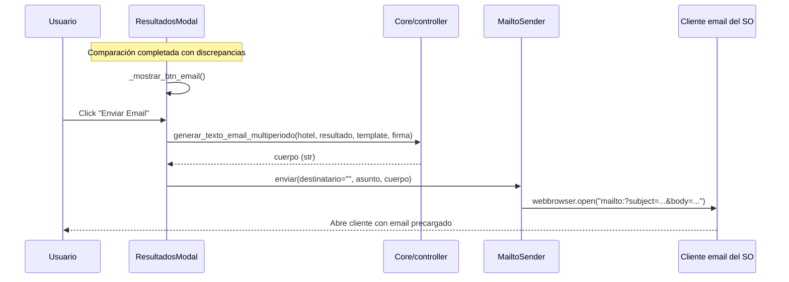

# Sistema de Email

Explicación del sistema de notificación por email tras una comparación de precios.

## Overview

Cuando una comparación detecta discrepancias, el usuario puede enviar un reporte
por email. El envío **no** se hace de forma programática (SMTP): se abre el
**cliente de email predeterminado del sistema operativo** con el asunto y el
cuerpo precargados, vía un enlace `mailto:`. El usuario completa el destinatario
y presiona enviar desde su propio cliente.

**Mecanismo**: enlace `mailto:` abierto con `webbrowser.open()` (Python stdlib)
**Sin credenciales**: no requiere `GMTP_KEY` ni configuración SMTP.

> Nota histórica: versiones anteriores enviaban por SMTP/Gmail con un modal de
> redacción propio (`ModalEmail`). Ese camino se eliminó por completo. Si ves
> referencias a `GMTP_KEY`, `smtplib` o `enviar_email_multiperiodo` en docs
> viejos, están obsoletas.

---

## Flujo de Envío



El callback es [`ResultadosModal._abrir_email()`](../../Hoteles/UI/views/resultados_modal.py).
El destinatario se deja **vacío** a propósito: el usuario lo completa en su
cliente. A futuro se planea una lista de destinatarios según el hotel elegido.

---

## Generación del Texto

**Función**: `generar_texto_email_multiperiodo(hotel, resultado, template, firma)`
**Archivo**: [`Core/controller.py`](../../Hoteles/Core/controller.py)

Renderiza un template con tags `{...}` y un bloque repetible por periodo. La
sustitución la hace `_renderizar_template()` en el mismo archivo.

### Template por defecto

**Archivo**: [`Core/email_templates.py`](../../Hoteles/Core/email_templates.py)

El template es **editable** desde el modal de configuración y se persiste vía
`ConfigService` (`get_email_template()` / `get_email_firma()`). Si no hay
template custom, se usa `DEFAULT_EMAIL_TEMPLATE`.

### Tags disponibles

**Globales** (`EMAIL_TAGS_GLOBALES`): `hotel`, `habitacion_excel`,
`habitacion_web`, `firma`.

**Por periodo** (`EMAIL_TAGS_PERIODO`, dentro del bloque ` ... `):
`periodo_id`, `fecha_inicio_periodo`, `fecha_fin_periodo`,
`fecha_inicio_busqueda`, `fecha_fin_busqueda`, `precio_excel`, `precio_web`,
`diferencia`, `estado`.

Ver [email-template-editable.md](../features/email-template-editable.md) para el
editor de templates.

---

## Envío vía mailto

**Clase**: `MailtoSender`
**Archivo**: [`Core/services/email_senders.py`](../../Hoteles/Core/services/email_senders.py)

```python
MailtoSender().enviar(destinatario: str, asunto: str, cuerpo: str) -> None
```

Arma `mailto:{destinatario}?subject=...&body=...` con los valores URL-encoded y
lo abre con `webbrowser.open()`.

### Límite de longitud (Windows)

Una URL `mailto:` tiene un límite práctico de ~2000 caracteres en Windows. El
sender usa un tope de `_MAILTO_BODY_LIMIT = 1800` para el cuerpo codificado:

- Si el cuerpo **no supera** el límite: se pasa completo al `mailto:`.
- Si lo **supera**: se copia el cuerpo completo al portapapeles (vía `pyperclip`)
  y el `body` del `mailto:` se trunca, agregando un aviso
  `[Tabla completa copiada al portapapeles — Ctrl+V para pegar]`.

**Dependencia opcional**: `pyperclip`. Si no está instalado, el email se abre
igual pero solo con el texto truncado (sin copia al portapapeles).

---

## Configuración

No requiere variables de entorno. El único estado configurable es:

- **Template de email** y **firma**, editables desde el modal de configuración y
  persistidos por `ConfigService`.

---

## Testing

El envío en sí no es testeable headless (depende del cliente de email del SO).
Lo que sí se puede testear es la **generación de texto**:

```python
from Core.controller import generar_texto_email_multiperiodo
texto = generar_texto_email_multiperiodo(hotel, resultado)
assert "{hotel}" not in texto  # tags sustituidos
```

---

## Mejoras Futuras

- **Lista de destinatarios por hotel**: prellenar `destinatario` según el hotel
  elegido (hoy se deja vacío).
- **Senders alternativos**: ver [email-config-opciones.md](../features/email-config-opciones.md)
  para el plan de factory de senders (Resend, SendGrid, Gmail OAuth) que
  conviviría con `MailtoSender`.

---

Ver también:
- [multiperiodo.md](multiperiodo.md) - Sistema de comparación completo
- [../features/email-template-editable.md](../features/email-template-editable.md) - Editor de templates
- [../features/resultados-modal-comparaciones-paralelas.md](../features/resultados-modal-comparaciones-paralelas.md) - Modal que dispara el envío
