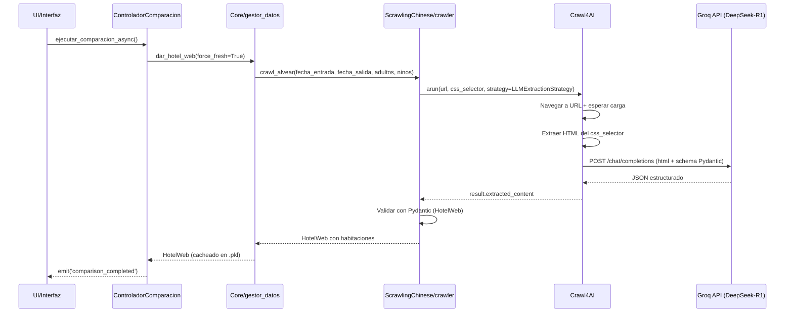

# Cómo Funciona el Scraper

Explicación completa del sistema de web scraping con LLM del proyecto.

## Overview

El scraper usa **Crawl4AI** (framework asíncrono de crawling) combinado con **DeepSeek-R1** (modelo LLM de Groq) para extraer datos estructurados de sitios web de hoteles.

**Stack tecnológico:**
- Crawl4AI 0.4.247 - Navegación y descarga de HTML
- Groq Cloud API - Hosting del modelo DeepSeek-R1
- DeepSeek-R1 (distil-llama-70b) - Extracción de datos con LLM
- Pydantic v2 - Validación de schema de datos extraídos
- asyncio/aiohttp - Operaciones asíncronas

---

## Arquitectura del Scraper



---

## Flujo Detallado

### 1. Inicialización del Crawler

**Archivo**: `ScrawlingChinese/crawler.py:15-30`

```python
async def crawl_alvear(fecha_entrada, fecha_salida, adultos=2, ninos=0):
    """
    Scrapea el sitio de Alvear Palace Hotel.

    Args:
        fecha_entrada: str YYYY-MM-DD
        fecha_salida: str YYYY-MM-DD
        adultos: int (default 2)
        ninos: int (default 0)

    Returns:
        HotelWeb con habitaciones y combos de precios
    """
```

**Parámetros de búsqueda** se construyen como URL:

```python
from ScrawlingChinese.config import BASE_URL

# Ejemplo: https://www.alvearpalace.com/search?checkin=2026-02-15&checkout=2026-02-16&adults=2&children=0
url = f"{BASE_URL}?checkin={fecha_entrada}&checkout={fecha_salida}&adults={adultos}&children={ninos}"
```

### 2. Configuración del Browser

**Archivo**: `ScrawlingChinese/utils/scraper_utils.py:20-40`

```python
browser_config = BrowserConfig(
    headless=True,                    # Sin GUI
    verbose=False,                    # Sin logs verbosos
    extra_args=["--disable-gpu"],     # Optimización
)

crawl_config = CrawlerRunConfig(
    wait_until="networkidle",         # Esperar carga completa
    css_selector=CSS_SELECTOR,        # Selector del contenido
    screenshot=False,                 # Sin screenshots
    page_timeout=60000,               # Timeout 60s
)
```

**CSS_SELECTOR** (desde `config.py`):

```python
CSS_SELECTOR = "div.rooms-container"  # Contenedor de habitaciones
```

### 3. Estrategia de Extracción LLM

**Archivo**: `ScrawlingChinese/utils/scraper_utils.py:45-70`

La estrategia LLM define:
1. **Provider**: Groq Cloud
2. **Modelo**: `distil-llama-70b` (DeepSeek-R1)
3. **Schema**: Modelo Pydantic que define estructura esperada
4. **Instrucción**: Prompt para el LLM

```python
extraction_strategy = LLMExtractionStrategy(
    provider="groq/deepseek-r1-distill-llama-70b",
    api_token=GROQ_API_KEY,
    schema=HotelWeb.model_json_schema(),  # Schema Pydantic → JSON Schema
    extraction_type="schema",
    instruction=(
        "Extrae información de habitaciones de hotel. "
        "Para cada habitación, identifica el nombre y todos los combos de precio disponibles. "
        "Cada combo tiene título, descripción opcional y precio. "
        "Retorna JSON que coincida exactamente con el schema provisto."
    ),
    chunk_token_threshold=4000,   # Máximo tokens por chunk
    overlap_rate=0.1,              # Overlap entre chunks (10%)
)
```

**Schema Pydantic** (desde `Models/hotelWeb.py`):

```python
class ComboPrecio(BaseModel):
    titulo: str               # Ej: "Standard Rate"
    descripcion: str = ""     # Ej: "Room only"
    precio: float             # Ej: 450.0

class HabitacionWeb(BaseModel):
    nombre: str                        # Ej: "Double Superior Room"
    combos_precios: List[ComboPrecio]  # Lista de opciones de precio

class HotelWeb(BaseModel):
    habitaciones: List[HabitacionWeb]
```

Este schema se convierte automáticamente a **JSON Schema** que el LLM entiende.

### 4. Ejecución del Crawling

**Archivo**: `ScrawlingChinese/utils/scraper_utils.py:75-120`

```python
async with AsyncWebCrawler(config=browser_config) as crawler:
    result = await crawler.arun(
        url=url,
        config=crawl_config,
        extraction_strategy=extraction_strategy
    )
```

**¿Qué hace Crawl4AI internamente?**

1. Abre browser headless (Chromium)
2. Navega a URL
3. Espera condición: `networkidle` (red idle = página cargada)
4. Extrae HTML del elemento `CSS_SELECTOR`
5. Divide HTML en chunks (si es muy grande)
6. Por cada chunk:
   - Construye prompt con HTML + schema + instrucción
   - Llama a Groq API: `POST /v1/chat/completions`
   - Recibe JSON del LLM
7. Combina todos los chunks en un solo JSON
8. Retorna `result.extracted_content`

### 5. Validación con Pydantic

**Archivo**: `ScrawlingChinese/crawler.py:40-60`

```python
# El LLM retorna un string JSON
json_data = result.extracted_content

# Parsear JSON
import json
data_dict = json.loads(json_data)

# Validar con Pydantic
try:
    hotel_web = HotelWeb(**data_dict)
except ValidationError as e:
    print(f"❌ Error de validación Pydantic: {e}")
    # Reintentar con ajustes...
```

**Validaciones automáticas de Pydantic:**
- ✅ `nombre` es string no vacío
- ✅ `precio` es float >= 0
- ✅ `combos_precios` es lista con al menos 1 elemento
- ✅ Estructura completa coincide con schema

Si la validación falla, el scraper puede reintentar (hasta 3 veces).

### 6. Caché de Resultados

**Archivo**: `Core/gestor_datos.py:50-80`

```python
def dar_hotel_web(self, fecha_entrada, fecha_salida, adultos, ninos, force_fresh=False):
    """
    Obtiene hotel web con caché.

    Args:
        force_fresh: bool - Si True, bypasea caché y scrapea fresco
    """

    if force_fresh:
        print("🔄 force_fresh=True, scraping fresco...")
        hotel_web = asyncio.run(crawl_alvear(...))
        self._guardar_cache(hotel_web)
        return hotel_web

    # Verificar caché
    if os.path.exists('hotel_guardado.pkl'):
        with open('hotel_guardado.pkl', 'rb') as f:
            hotel_web = pickle.load(f)
        print("✅ Cargado desde caché")
        return hotel_web

    # Cache miss
    hotel_web = asyncio.run(crawl_alvear(...))
    self._guardar_cache(hotel_web)
    return hotel_web
```

**Formato del caché**: `hotel_guardado.pkl` (pickle binario)

**Cuándo se usa caché:**
- Primera comparación: NO (scraping fresco)
- Comparaciones subsiguientes: SÍ (si parámetros coinciden)
- Multi-periodo: NO (siempre `force_fresh=True`)

---

## Sistema de Reintentos

**Archivo**: `ScrawlingChinese/utils/scraper_utils.py:90-130`

```python
MAX_RETRIES = 3

for intento in range(1, MAX_RETRIES + 1):
    try:
        result = await crawler.arun(...)

        if result.extracted_content:
            # Validar con Pydantic
            hotel_web = HotelWeb(**json.loads(result.extracted_content))
            print(f"✅ Extracción exitosa en intento {intento}")
            return hotel_web
        else:
            print(f"⚠️  Intento {intento}: Sin contenido extraído")

    except ValidationError as e:
        print(f"⚠️  Intento {intento}: Error de validación Pydantic")
        print(f"   {e}")

    except Exception as e:
        print(f"❌ Intento {intento}: Error inesperado: {e}")

    if intento < MAX_RETRIES:
        await asyncio.sleep(2)  # Delay antes de reintentar

# Si todos los intentos fallan
raise Exception("No se pudo extraer datos después de 3 intentos")
```

**Causas comunes de fallo:**
1. HTML cambió (CSS_SELECTOR desactualizado)
2. LLM retornó JSON inválido
3. Timeout de red
4. Rate limiting de Groq API

---

## Performance y Costos

### Tiempos de Ejecución

**Scraping exitoso típico:**
- Navegación + descarga HTML: 2-3s
- Extracción LLM: 2-5s
- Validación Pydantic: <0.1s
- **Total: ~5-10s**

**Multi-periodo (3 periodos):**
- Scraping periodo 1: ~7s
- Delay: 2s
- Scraping periodo 2: ~7s
- Delay: 2s
- Scraping periodo 3: ~7s
- **Total: ~27s**

### Costos de API

**Groq Cloud (Gratis):**
- Límite: 14,400 requests/día
- Modelo: DeepSeek-R1 distil (gratuito en preview)
- Token limit: 8,192 tokens/request

**Estimación de uso:**
- Scraping simple: ~2,000 tokens
- Multi-periodo (3 periodos): ~6,000 tokens
- Testing diario intensivo: ~50 scrapings = ~100,000 tokens

**En plan gratuito**: Suficiente para desarrollo y testing.

---

## Limitaciones y Consideraciones

### 1. Rate Limiting

**Problema**: Demasiados requests → 429 Too Many Requests

**Solución**: Delays entre scrapings

```python
# En Core/comparador_multiperiodo.py:130
SCRAPING_DELAY_SECONDS = os.getenv('SCRAPING_DELAY_SECONDS', 2)
await asyncio.sleep(SCRAPING_DELAY_SECONDS)
```

### 2. Cambios en el HTML

**Problema**: El sitio web cambia estructura → CSS_SELECTOR no encuentra nada

**Solución**: Actualizar `CSS_SELECTOR` en `ScrawlingChinese/config.py`

```python
# Inspeccionar HTML del sitio actualizado
# Buscar nuevo selector que contenga habitaciones
CSS_SELECTOR = "div.new-rooms-container"  # Actualizar aquí
```

### 3. LLM No Determinístico

**Problema**: A veces el LLM retorna formato ligeramente diferente

**Solución**:
- Schema Pydantic estricto fuerza validación
- Reintentos automáticos (hasta 3)
- Ajustar instrucción en extraction_strategy

### 4. IP Bans

**Problema**: Scraping agresivo → IP baneada por el sitio

**Solución**:
- Delays configurables
- User-Agent rotación (futuro)
- Proxies (futuro)

### 5. JavaScript Pesado

**Problema**: Sitio carga contenido dinámico vía JS

**Solución**: `wait_until="networkidle"` asegura que JS termine de ejecutar

---

## Debugging del Scraper

Ver [troubleshooting.md](troubleshooting.md) para guía completa.

**Quick debug:**

```python
# 1. Ver HTML crudo descargado
with open('debug_html.html', 'w', encoding='utf-8') as f:
    f.write(result.html)

# 2. Ver input del LLM
print(f"📥 Input LLM (primeros 500 chars):")
print(result.html[:500])

# 3. Ver output del LLM
print(f"📤 Output LLM:")
print(result.extracted_content)

# 4. Ver errores de validación Pydantic
try:
    hotel_web = HotelWeb(**json.loads(result.extracted_content))
except ValidationError as e:
    print(f"❌ Validación falló:")
    print(e)
```

---

## Extender a Otros Sitios

Ver [multi-sitio.md](multi-sitio.md) para guía completa.

**Pasos básicos:**

1. Crear nueva función en `crawler.py`:
   ```python
   async def crawl_marriott(...):
       # Similar a crawl_alvear()
   ```

2. Actualizar `config.py` con nueva URL y selector:
   ```python
   MARRIOTT_URL = "https://www.marriott.com/..."
   MARRIOTT_SELECTOR = "div.marriott-rooms"
   ```

3. Ajustar schema si estructura difiere:
   ```python
   # Puede requerir modelo Pydantic diferente
   class HabitacionMarriott(BaseModel):
       # ... campos específicos de Marriott
   ```

4. Registrar en `CRAWLERS` dict (para skill /test-scraper):
   ```python
   CRAWLERS = {
       "alvear": crawl_alvear,
       "marriott": crawl_marriott,  # Nuevo
   }
   ```

---

Ver también:
- [configuracion.md](configuracion.md) - Configuración detallada del scraper
- [troubleshooting.md](troubleshooting.md) - Resolución de problemas
- [multi-sitio.md](multi-sitio.md) - Agregar más hoteles
