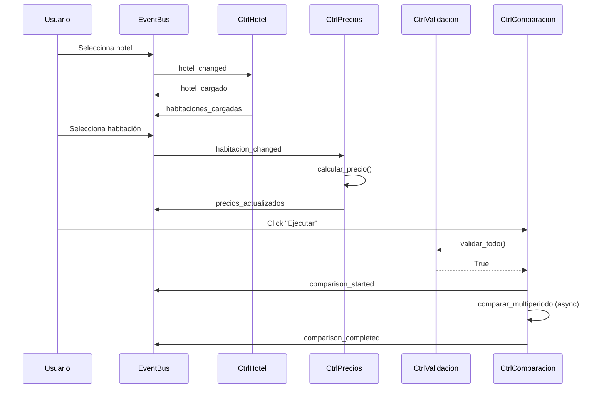

# Controladores UI

Documentación completa de los controladores UI que orquestan la lógica de negocio sin dependencias directas de widgets.

Todos los controladores siguen el pattern: `__init__(estado_app, event_bus)` y usan eventos para comunicarse.

## Tabla de Contenidos

- [ControladorHotel](#controladorhotel)
- [ControladorValidacion](#controladorvalidacion)
- [ControladorComparacion](#controladorcomparacion)
- [ControladorPrecios](#controladorprecios)

---

## ControladorHotel

**Archivo**: [UI/controllers/controlador_hotel.py](../../Hoteles/UI/controllers/controlador_hotel.py)

### Propósito

Gestiona la carga de hoteles, edificios y habitaciones desde Excel. Agrupa habitaciones por periodos.

### Responsabilidades

- Cargar lista de hoteles desde estado
- Cargar edificios/tipos según hotel seleccionado
- Cargar habitaciones según hotel/edificio
- Agrupar habitaciones por periodos aplicables
- Emitir eventos cuando se cargan datos

### Constructor

```python
def __init__(self, estado_app: AppState, event_bus: EventBus):
    self.estado_app = estado_app
    self.event_bus = event_bus

    # Suscribirse a eventos
    self.event_bus.on('hotel_changed', self.on_hotel_changed)
    self.event_bus.on('edificio_changed', self.on_edificio_changed)
```

### Métodos Principales

#### `cargar_hoteles() → list[str]`
Carga lista de nombres de hoteles (sin duplicados, sin sufijo "(A)").

```python
hoteles = controlador.cargar_hoteles()
# ["Alvear Palace", "Four Seasons", "Marriott"]
```

**Implementación**:
```python
def cargar_hoteles(self):
    hoteles = self.estado_app.hoteles_excel
    nombres = [h.nombre.replace(" (A)", "").strip() for h in hoteles]
    return list(set(nombres))  # Sin duplicados
```

---

#### `cargar_edificios(hotel_nombre: str) → list[str]`
Carga nombres únicos de edificios/tipos de un hotel.

```python
edificios = controlador.cargar_edificios("Alvear Palace")
# ["Palace Wing", "Garden Wing"]
```

**Implementación**:
```python
def cargar_edificios(self, hotel_nombre):
    # Buscar hotel
    hotel = next((h for h in self.estado_app.hoteles_excel
                 if hotel_nombre in h.nombre), None)

    if not hotel or not hotel.tipos:
        return []

    # Nombres únicos
    return list(set([t.nombre for t in hotel.tipos]))
```

---

#### `cargar_habitaciones(hotel_nombre: str, edificio_nombre: str = None) → list[str]`
Carga nombres de habitaciones unificadas (sin duplicados).

```python
# Habitaciones de hotel sin tipos
habitaciones = controlador.cargar_habitaciones("Hotel Simple")
# ["dbl superior", "dbl deluxe", "suite"]

# Habitaciones de edificio específico
habitaciones = controlador.cargar_habitaciones("Alvear Palace", "Palace Wing")
# ["dbl superior palace", "dbl deluxe palace"]
```

**Implementación**:
```python
def cargar_habitaciones(self, hotel_nombre, edificio_nombre=None):
    from Core.servicio_habitaciones import unificar_habitaciones

    hotel = next((h for h in self.estado_app.hoteles_excel
                 if hotel_nombre in h.nombre), None)

    if not hotel:
        return []

    # Obtener habitaciones unificadas
    habitaciones_unif = unificar_habitaciones(hotel)

    # Filtrar por edificio si es necesario
    if edificio_nombre:
        habitaciones_unif = [h for h in habitaciones_unif
                            if h.tipo_origen and h.tipo_origen.nombre == edificio_nombre]

    # Nombres únicos
    nombres = list(set([h.nombre for h in habitaciones_unif]))
    return sorted(nombres)
```

---

### Event Handlers

#### `on_hotel_changed(hotel_nombre: str)`
Maneja evento cuando cambia selección de hotel.

```python
def on_hotel_changed(self, hotel_nombre):
    # Buscar hotel
    hotel = next((h for h in self.estado_app.hoteles_excel
                 if hotel_nombre in h.nombre), None)

    if not hotel:
        return

    # Determinar si tiene tipos
    tiene_tipos = bool(hotel.tipos)

    # Emitir evento con datos
    self.event_bus.emit('hotel_cargado', {
        'hotel': hotel,
        'tiene_tipos': tiene_tipos
    })

    # Si NO tiene tipos → cargar habitaciones directas
    if not tiene_tipos:
        habitaciones = self.cargar_habitaciones(hotel_nombre)
        self.event_bus.emit('habitaciones_cargadas', habitaciones)
```

**Eventos emitidos**:
- `hotel_cargado` - data: `{hotel: HotelExcel, tiene_tipos: bool}`
- `habitaciones_cargadas` - data: `list[str]` (si no tiene tipos)

---

#### `on_edificio_changed(edificio_nombre: str)`
Maneja evento cuando cambia selección de edificio.

```python
def on_edificio_changed(self, edificio_nombre):
    hotel_nombre = self.estado_app.hotel.get()
    habitaciones = self.cargar_habitaciones(hotel_nombre, edificio_nombre)
    self.event_bus.emit('habitaciones_cargadas', habitaciones)
```

**Eventos emitidos**:
- `habitaciones_cargadas` - data: `list[str]`

---

### Tabla de Eventos

| Evento | Escucha/Emite | Data | Descripción |
|--------|---------------|------|-------------|
| `hotel_changed` | ✅ Escucha | `str` (nombre hotel) | AppState detectó cambio en combobox |
| `edificio_changed` | ✅ Escucha | `str` (nombre edificio) | AppState detectó cambio |
| `hotel_cargado` | ⬆️ Emite | `{hotel, tiene_tipos}` | Hotel cargado con metadata |
| `habitaciones_cargadas` | ⬆️ Emite | `list[str]` | Habitaciones disponibles |

---

## ControladorValidacion

**Archivo**: [UI/controllers/controlador_validacion.py](../../Hoteles/UI/controllers/controlador_validacion.py)

### Propósito

Orquesta una lista de **Validators** desacoplados y devuelve un `ValidationResult` con todos los errores encontrados. **NO abre UI** — la presentación (messagebox, panel inline, etc.) queda a cargo de quien lo invoque.

### Patrón: Validator + ValidationResult

```
ControladorValidacion
   ├─ ExcelCargadoValidator   → ¿Hay un Excel cargado? (red de seguridad)
   ├─ CamposValidator          → Campos no vacíos, adultos ≥ 1
   └─ FechasValidator          → Formato DD-MM-AAAA, no-pasado, orden
```

Cada validator implementa el protocolo `Validator` (`validate(state) → ValidationResult`) y es independiente del resto. Agregar uno nuevo (ej: email válido, API key configurada) = crear una clase y sumarla a la lista, **sin tocar el orquestador ni los demás validators**.

### Estructuras de datos

```python
@dataclass
class ValidationError:
    campo: str                  # "fecha_entrada", "excel", "adultos"
    mensaje: str
    severity: str = "error"     # "error" | "warning"

@dataclass
class ValidationResult:
    errors: list[ValidationError] = field(default_factory=list)

    @property
    def is_valid(self) -> bool:      # True si no hay errores
        ...

    def merge(self, other) -> None:  # Combina resultados
        ...

    def mensajes_concatenados(self) -> str:  # Bullets para UI
        ...
```

### Constructor

```python
def __init__(self, estado_app: AppState, validators: list[Validator] | None = None):
    # Si no se pasan validators, usa los default en orden correcto.
    self._validators = validators or [
        ExcelCargadoValidator(),
        CamposValidator(),
        FechasValidator(),
    ]
```

Permite inyectar una lista custom para tests o flujos especiales.

### Método principal

#### `validar_todo() → ValidationResult`

Ejecuta TODOS los validators y mergea los errores. Devuelve un único `ValidationResult` con la lista completa.

```python
result = controlador.validar_todo()
if not result.is_valid:
    # result.errors → list[ValidationError]
    # result.mensajes_concatenados() → "• ...\n• ..."
    ...
```

**Beneficio sobre el contrato viejo**: antes devolvía `bool` y mostraba solo el primer error con `messagebox.showerror()`. Ahora se muestran **todos los errores juntos** y el llamador elige cómo presentarlos.

---

### Ejemplo de uso

```python
from UI.controllers.controlador_validacion import ControladorValidacion
from tkinter import messagebox

controlador = ControladorValidacion(estado_app)
result = controlador.validar_todo()

if not result.is_valid:
    messagebox.showerror(
        "Datos incompletos",
        "Revisá los siguientes campos:\n\n" + result.mensajes_concatenados()
    )
    return
# Validación OK → seguir con el flujo
```

### Cómo agregar un validator nuevo

```python
# UI/controllers/validators/email_validator.py
from .base import ValidationError, ValidationResult

class EmailValidator:
    def validate(self, state) -> ValidationResult:
        result = ValidationResult()
        email = getattr(state, "user_email", None)
        if not email or "@" not in (email.get() if hasattr(email, "get") else email):
            result.errors.append(ValidationError(
                campo="email",
                mensaje="El email del usuario es inválido o no está configurado.",
            ))
        return result

# Luego, al construir ControladorValidacion:
ControladorValidacion(state, validators=[
    ExcelCargadoValidator(),
    CamposValidator(),
    FechasValidator(),
    EmailValidator(),
])
```

Ningún otro archivo se modifica.

---

## ControladorComparacion

**Archivo**: [UI/controllers/controlador_comparacion.py](../../Hoteles/UI/controllers/controlador_comparacion.py)

### Propósito

Ejecuta la comparación multi-periodo de forma asíncrona sin bloquear la UI.

### Responsabilidades

- Validar campos antes de comparar
- Ejecutar comparación en thread daemon
- Emitir eventos de inicio/fin/error
- Manejar excepciones durante comparación

### Constructor

```python
def __init__(self, estado_app: AppState, event_bus: EventBus, controlador_validacion: ControladorValidacion):
    self.estado_app = estado_app
    self.event_bus = event_bus
    self.controlador_validacion = controlador_validacion
```

**Nota**: Recibe `controlador_validacion` como dependencia.

---

### Métodos Principales

#### `ejecutar_comparacion_async()`
Dispara comparación en background thread.

```python
controlador.ejecutar_comparacion_async()
# Retorna inmediatamente, comparación corre en background
```

**Flujo**:
1. Crea thread daemon
2. Ejecuta `_run_async()` en el thread
3. Retorna inmediatamente (no bloquea)

**Implementación**:
```python
def ejecutar_comparacion_async(self):
    def run_async():
        asyncio.run(self._ejecutar_comparacion())

    thread = threading.Thread(target=run_async, daemon=True)
    thread.start()
```

---

#### `_run_async()` (interno)
Wrapper para ejecutar función async en thread.

---

#### `_ejecutar_comparacion()` (async, interno)
Función async principal que ejecuta la comparación.

```python
async def _ejecutar_comparacion(self):
    # 1. Validar campos
    if not self.controlador_validacion.validar_todo():
        return  # Validación falló, mensajes ya mostrados

    # 2. Emitir evento de inicio
    self.event_bus.emit('comparison_started')

    try:
        # 3. Parsear fechas
        fecha_entrada = datetime.strptime(fecha_entrada_str, "%d-%m-%Y").date()
        fecha_salida = datetime.strptime(fecha_salida_str, "%d-%m-%Y").date()

        # 4. Buscar hotel y habitación
        hotel = next((h for h in self.estado_app.hoteles_excel
                     if habitacion_nombre in h.nombre), None)

        habitacion_unificada = next(
            (h for h in self.estado_app.habitaciones_unificadas
             if h.nombre == habitacion_nombre),
            None
        )

        # 5. Ejecutar comparación multi-periodo
        from Core.comparador_multiperiodo import comparar_multiperiodo

        resultado = await comparar_multiperiodo(
            hotel=hotel,
            habitacion_unificada=habitacion_unificada,
            fecha_entrada=fecha_entrada,
            fecha_salida=fecha_salida,
            adultos=adultos,
            ninos=ninos
        )

        # 6. Guardar resultado en estado
        self.estado_app.resultado_multiperiodo = resultado

        # 7. Emitir evento de completado
        self.event_bus.emit('comparison_completed', resultado)

    except Exception as e:
        # Emitir evento de error
        self.event_bus.emit('comparison_error', str(e))
```

---

### Tabla de Eventos

| Evento | Escucha/Emite | Data | Descripción |
|--------|---------------|------|-------------|
| `comparison_started` | ⬆️ Emite | `None` | Comparación iniciada |
| `comparison_completed` | ⬆️ Emite | `ResultadoComparacionMultiperiodo` | Comparación exitosa |
| `comparison_error` | ⬆️ Emite | `str` (mensaje error) | Error durante comparación |

---

### Ejemplo de Uso

```python
from UI.controllers.controlador_comparacion import ControladorComparacion
from UI.controllers.controlador_validacion import ControladorValidacion
from UI.state.app_state import AppState
from UI.state.event_bus import EventBus

event_bus = EventBus()
estado_app = AppState(event_bus)

# Crear controladores
controlador_validacion = ControladorValidacion(estado_app)
controlador_comparacion = ControladorComparacion(estado_app, event_bus, controlador_validacion)

# Suscribirse a eventos
def on_started():
    print("🔄 Comparación iniciada...")

def on_completed(resultado):
    print(f"✅ Comparación completada: {resultado.resumen()}")

def on_error(mensaje):
    print(f"❌ Error: {mensaje}")

event_bus.on('comparison_started', on_started)
event_bus.on('comparison_completed', on_completed)
event_bus.on('comparison_error', on_error)

# Configurar estado (hotel, habitación, fechas, etc.)
# ...

# Ejecutar
controlador_comparacion.ejecutar_comparacion_async()
# Retorna inmediatamente, eventos se emiten cuando termine
```

---

## ControladorPrecios

**Archivo**: [UI/controllers/controlador_precios.py](../../Hoteles/UI/controllers/controlador_precios.py)

### Propósito

Calcula precio de habitación según periodos aplicables y actualiza `AppState.precio`.

### Responsabilidades

- Escuchar cambio de habitación
- Calcular precio según periodos y fechas
- Actualizar `AppState.precio` dinámicamente
- Emitir evento `precios_actualizados`

### Constructor

```python
def __init__(self, estado_app: AppState, event_bus: EventBus):
    self.estado_app = estado_app
    self.event_bus = event_bus

    # Suscribirse a eventos
    self.event_bus.on('habitacion_unificada_changed', self.on_habitacion_changed)
    # También escucha cambios en fechas (traces en AppState)
```

---

### Métodos Principales

#### `calcular_precio(habitacion_unificada: HabitacionUnificada, hotel: HotelExcel) → str`
Calcula precio según periodos aplicables.

**Lógica**:
1. Si NO hay fechas → `"(ninguna seleccionada)"`
2. Si NO hay periodos aplicables → `"(sin periodos aplicables)"`
3. Si hay 1 periodo → Precio simple (ej: `"$150.00"`)
4. Si hay múltiples periodos con mismo precio → Precio simple
5. Si hay múltiples periodos con precios diferentes → Rango (ej: `"$120.00 - $180.00"`)

```python
precio_str = controlador.calcular_precio(habitacion_unificada, hotel)
# "$150.00" o "$120.00 - $180.00" o "(ninguna seleccionada)"
```

**Implementación** (simplificada):
```python
def calcular_precio(self, habitacion_unificada, hotel):
    # Sin fechas
    if not self.estado_app.fecha_entrada_completa.get():
        return "(ninguna seleccionada)"

    # Inferir periodos aplicables
    periodos_aplicables = inferir_periodos_desde_fechas(
        hotel,
        fecha_entrada,
        fecha_salida,
        habitacion_unificada.periodo_ids
    )

    if not periodos_aplicables:
        return "(sin periodos aplicables)"

    # Obtener precios de cada periodo
    precios = []
    for periodo in periodos_aplicables:
        precio = habitacion_unificada.precio_para_periodo(periodo.id)
        if isinstance(precio, (int, float)):
            precios.append(precio)

    if not precios:
        return "(sin precio)"

    # Un solo precio o todos iguales
    if len(set(precios)) == 1:
        return f"${precios[0]:.2f}"

    # Múltiples precios diferentes
    return f"${min(precios):.2f} - ${max(precios):.2f}"
```

---

#### `on_habitacion_changed(habitacion_nombre: str)`
Maneja evento cuando cambia habitación seleccionada.

```python
def on_habitacion_changed(self, habitacion_nombre):
    # Buscar habitación unificada
    habitacion = next((h for h in self.estado_app.habitaciones_unificadas
                      if h.nombre == habitacion_nombre), None)

    if not habitacion:
        return

    # Buscar hotel
    hotel = next((h for h in self.estado_app.hoteles_excel
                 if hotel_nombre in h.nombre), None)

    # Calcular precio
    precio_str = self.calcular_precio(habitacion, hotel)

    # Actualizar estado
    self.estado_app.precio.set(precio_str)

    # Emitir evento
    self.event_bus.emit('precios_actualizados', {
        'tipo': 'calculado',
        'precio': precio_str,
        'habitacion': habitacion
    })
```

---

### Tabla de Eventos

| Evento | Escucha/Emite | Data | Descripción |
|--------|---------------|------|-------------|
| `habitacion_unificada_changed` | ✅ Escucha | `HabitacionUnificada` | Habitación seleccionada cambió (emitido desde `_on_habitacion_changed` en CrawlCompareGUI) |
| `precios_actualizados` | ⬆️ Emite | ver abajo | Precio(s) calculados y actualizados |

**Formatos del evento `precios_actualizados`**:

```python
# Precios calculados exitosamente
{
    'tipo': 'precios_calculados',
    'precios': [
        {'periodo': Periodo, 'precio': float, 'nombre_grupo': str},
        ...
    ]
}

# Sin fechas ingresadas
{
    'tipo': 'sin_fechas',
    'mensaje': str
}

# Sin periodos aplicables para las fechas
{
    'tipo': 'sin_periodos',
    'mensaje': str
}
```

`CrawlCompareGUI._on_precios_actualizados()` despacha:
- `tipo == 'precios_calculados'` → `CTkPrecioPanel.mostrar_precios_multiples(data['precios'])`
- `tipo in ('sin_fechas', 'sin_periodos')` → `CTkPrecioPanel._mostrar_mensaje(data['mensaje'])`

---

## Diagrama de Interacción entre Controladores



---

## Resumen de Controladores

| Controlador | Eventos Escuchados | Eventos Emitidos | Propósito |
|-------------|-------------------|------------------|-----------|
| **ControladorHotel** | `hotel_changed`, `edificio_changed` | `hotel_cargado`, `habitaciones_cargadas` | Cargar datos de Excel |
| **ControladorValidacion** | - | - | Validar formulario |
| **ControladorComparacion** | - | `comparison_started`, `comparison_completed`, `comparison_error` | Ejecutar comparación async |
| **ControladorPrecios** | `habitacion_unificada_changed` | `precios_actualizados` | Calcular precio dinámico |

---

Ver también:
- [../desarrollo/convenciones.md#pattern-controlador](../desarrollo/convenciones.md#pattern-controlador) - Pattern completo
- [../arquitectura/event-driven-mvc.md](../arquitectura/event-driven-mvc.md) - Arquitectura event-driven
- [../arquitectura/flujos-principales.md](../arquitectura/flujos-principales.md) - Flujos que usan controladores