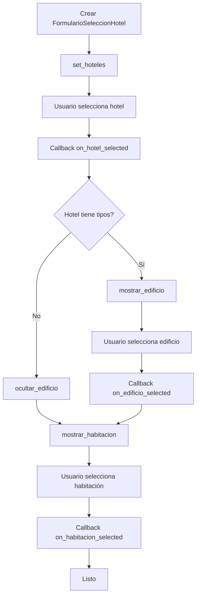
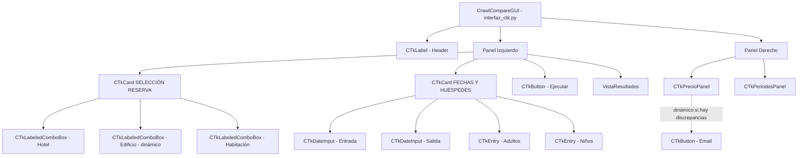
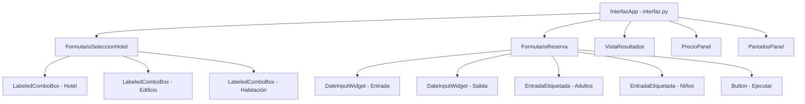

# Vistas UI

Documentación de las vistas compuestas que agrupan múltiples componentes para formar pantallas completas.

Las vistas combinan componentes reutilizables ([ver componentes.md](componentes.md)) para crear funcionalidad más compleja.

> **Estado actual**: La interfaz activa es `CrawlCompareGUI` (`interfaz_ctk.py`).
> En esta versión, los formularios se construyen **inline** con componentes CTk dentro de `CTkCard`,
> sin instanciar `FormularioSeleccionHotel` ni `FormularioReserva` como vistas separadas.
> Las vistas de formulario siguen existiendo para uso con `InterfazApp` (Tkinter legacy).
> **`VistaResultados` es compartida** entre ambas interfaces.

## Tabla de Contenidos

- [FormularioSeleccionHotel](#formularioseleccionhotel) ← usado en InterfazApp (legacy)
- [FormularioReserva](#formularioreserva) ← usado en InterfazApp (legacy)
- [VistaResultados](#vistaresultados) ← compartida entre ambas interfaces

---

## FormularioSeleccionHotel

**Archivo**: [UI/views/formulario_seleccion_hotel.py](../../Hoteles/UI/views/formulario_seleccion_hotel.py)

### Propósito

Vista compuesta que maneja la selección en cascada de hotel → edificio → habitación. Muestra/oculta el selector de edificio dinámicamente según la estructura del hotel.

### Parámetros de Inicialización

| Parámetro | Tipo | Descripción |
|-----------|------|-------------|
| `parent` | Widget | Widget padre (obligatorio) |
| `estado_app` | AppState | Estado centralizado de la aplicación (obligatorio) |
| `fonts` | FontManager | Gestor de fuentes (obligatorio) |
| `**kwargs` | dict | Args adicionales para Frame |

### Estructura Visual Dinámica

```
┌──────────────────────────┐
│ Hotel:                   │
│ [Alvear Palace        ▼] │ ← Siempre visible
├──────────────────────────┤
│ Edificio:                │ ← Dinámico (solo si hotel tiene tipos)
│ [Palace Wing          ▼] │
├──────────────────────────┤
│ Habitación Excel:        │
│ [dbl superior         ▼] │ ← Aparece después de seleccionar hotel/edificio
└──────────────────────────┘
```

### Componentes Internos

- **3 LabeledComboBox**:
  1. `self._combo_hotel` - Selector de hotel (siempre visible)
  2. `self._combo_edificio` - Selector de edificio (dinámico)
  3. `self._combo_habitacion` - Selector de habitación

### Métodos Principales

#### `mostrar_edificio(valores: list[str])`
Muestra el selector de edificio con opciones.

```python
formulario.mostrar_edificio(["Palace Wing", "Garden Wing"])
```

**Efecto**:
- Hace visible el combobox edificio (row=1)
- Mueve combobox habitación a row=2
- Actualiza valores del combobox

#### `ocultar_edificio()`
Oculta el selector de edificio.

```python
formulario.ocultar_edificio()
```

**Efecto**:
- Oculta combobox edificio
- Mueve combobox habitación a row=1

#### `mostrar_habitacion(valores: list[str])`
Muestra el selector de habitación con opciones.

```python
formulario.mostrar_habitacion(["dbl superior", "dbl deluxe", "suite"])
```

#### `ocultar_habitacion()`
Oculta el selector de habitación.

```python
formulario.ocultar_habitacion()
```

#### `set_hoteles(valores: list[str])`
Establece lista de hoteles.

```python
formulario.set_hoteles(["Alvear Palace", "Four Seasons"])
```

#### `seleccionar_hotel(hotel_nombre: str)`
Selecciona un hotel programáticamente.

```python
formulario.seleccionar_hotel("Alvear Palace")
```

### Callbacks

#### `on_hotel_selected(callback: Callable)`
Registra callback para selección de hotel.

```python
def on_hotel(event=None):
    print(f"Hotel seleccionado: {estado_app.hotel.get()}")

formulario.on_hotel_selected(on_hotel)
```

#### `on_edificio_selected(callback: Callable)`
Registra callback para selección de edificio.

#### `on_habitacion_selected(callback: Callable)`
Registra callback para selección de habitación.

### Flujo de Uso



### Ejemplo de Uso

```python
import tkinter as tk
from UI.views.formulario_seleccion_hotel import FormularioSeleccionHotel
from UI.state.app_state import AppState
from UI.state.event_bus import EventBus
from UI.styles.fonts import FontManager

root = tk.Tk()
root.title("Test FormularioSeleccionHotel")

# Crear dependencias
event_bus = EventBus()
estado_app = AppState(event_bus)
fonts = FontManager(root)

# Crear formulario
formulario = FormularioSeleccionHotel(
    root,
    estado_app=estado_app,
    fonts=fonts
)
formulario.pack(padx=20, pady=20)

# Establecer hoteles
formulario.set_hoteles(["Alvear Palace", "Four Seasons"])

# Callbacks
def on_hotel_selected(event=None):
    hotel = estado_app.hotel.get()
    print(f"Hotel seleccionado: {hotel}")

    # Simular: si hotel tiene tipos
    if "Alvear" in hotel:
        formulario.mostrar_edificio(["Palace Wing", "Garden Wing"])
    else:
        formulario.ocultar_edificio()
        formulario.mostrar_habitacion(["Suite A", "Suite B"])

def on_edificio_selected(event=None):
    edificio = estado_app.edificio.get()
    print(f"Edificio seleccionado: {edificio}")
    formulario.mostrar_habitacion(["dbl superior", "dbl deluxe"])

def on_habitacion_selected(event=None):
    habitacion = estado_app.habitacion.get()
    print(f"Habitación seleccionada: {habitacion}")

formulario.on_hotel_selected(on_hotel_selected)
formulario.on_edificio_selected(on_edificio_selected)
formulario.on_habitacion_selected(on_habitacion_selected)

root.mainloop()
```

---

## FormularioReserva

**Archivo**: [UI/views/formulario_reserva.py](../../Hoteles/UI/views/formulario_reserva.py)

### Propósito

Vista compuesta que agrupa fechas de entrada/salida, cantidad de adultos/niños y botón de ejecución.

### Parámetros de Inicialización

| Parámetro | Tipo | Descripción |
|-----------|------|-------------|
| `parent` | Widget | Widget padre (obligatorio) |
| `estado_app` | AppState | Estado centralizado (obligatorio) |
| `fonts` | FontManager | Gestor de fuentes (obligatorio) |
| `on_submit` | Callable | Callback para botón "Ejecutar" (obligatorio) |
| `**kwargs` | dict | Args adicionales para Frame |

### Estructura Visual

```
┌────────────────────────────┐
│ Fecha de entrada:          │
│ [15] - [02] - [2026]       │ ← DateInputWidget
├────────────────────────────┤
│ Fecha de salida:           │
│ [20] - [02] - [2026]       │ ← DateInputWidget
├────────────────────────────┤
│ Adultos:    │ Niños:       │
│ [  2  ]     │ [  0  ]      │ ← EntradaEtiquetada (inline)
├────────────────────────────┤
│ [ Ejecutar Comparación ]   │ ← Botón
└────────────────────────────┘
```

### Componentes Internos

- **2 DateInputWidget**: Entrada y salida
- **2 EntradaEtiquetada**: Adultos y niños
- **1 ttk.Button**: Ejecutar comparación

### Métodos Principales

#### `obtener_fecha_entrada() → str`
Obtiene fecha de entrada en formato "DD-MM-AAAA".

```python
fecha = formulario.obtener_fecha_entrada()
# "15-02-2026"
```

#### `obtener_fecha_salida() → str`
Obtiene fecha de salida en formato "DD-MM-AAAA".

```python
fecha = formulario.obtener_fecha_salida()
# "20-02-2026"
```

#### `obtener_adultos() → int`
Obtiene cantidad de adultos.

```python
adultos = formulario.obtener_adultos()
# 2
```

#### `obtener_ninos() → int`
Obtiene cantidad de niños.

```python
ninos = formulario.obtener_ninos()
# 0
```

#### `resetear()`
Limpia todos los campos a valores por defecto.

```python
formulario.resetear()
# Borra fechas, adultos=1, niños=0
```

### Validación Integrada

El formulario NO valida internamente. La validación se hace en `ControladorValidacion` cuando el usuario clickea "Ejecutar".

Ver [controladores.md#controladorvalidacion](controladores.md#controladorvalidacion) para detalles de validación.

### Ejemplo de Uso

```python
import tkinter as tk
from UI.views.formulario_reserva import FormularioReserva
from UI.state.app_state import AppState
from UI.state.event_bus import EventBus
from UI.styles.fonts import FontManager

root = tk.Tk()
root.title("Test FormularioReserva")

# Crear dependencias
event_bus = EventBus()
estado_app = AppState(event_bus)
fonts = FontManager(root)

# Callback para botón ejecutar
def on_ejecutar():
    print(f"Fecha entrada: {formulario.obtener_fecha_entrada()}")
    print(f"Fecha salida: {formulario.obtener_fecha_salida()}")
    print(f"Adultos: {formulario.obtener_adultos()}")
    print(f"Niños: {formulario.obtener_ninos()}")

# Crear formulario
formulario = FormularioReserva(
    root,
    estado_app=estado_app,
    fonts=fonts,
    on_submit=on_ejecutar
)
formulario.pack(padx=20, pady=20)

# Botón para resetear
tk.Button(root, text="Resetear", command=formulario.resetear).pack()

root.mainloop()
```

---

## VistaResultados

**Archivo**: [UI/views/vista_resultados.py](../../Hoteles/UI/views/vista_resultados.py)

### Propósito

Vista para visualización de resultados de comparación. Soporta texto simple y tabla comparativa multi-periodo.

### Parámetros de Inicialización

| Parámetro | Tipo | Descripción |
|-----------|------|-------------|
| `parent` | Widget | Widget padre (obligatorio) |
| `fonts` | FontManager | Gestor de fuentes (obligatorio) |
| `**kwargs` | dict | Args adicionales para Frame |

### Estructura Visual

```
┌────────────────────────────────────┐
│ COMPARACIÓN MULTI-PERIODO          │
│                                    │
│ Habitación Excel: dbl superior     │
│ Habitación Web: Double Superior    │
│                                    │
│ Estado: ❌ DISCREPANCIAS DETECTADAS│
│                                    │
│ ┌────────┬────────┬───────┬─────┐ │
│ │Periodo │Excel   │Web    │Estado│ │
│ ├────────┼────────┼───────┼─────┤ │
│ │low     │$150.00 │$140.00│❌ DIFF│ │
│ │high    │$180.00 │$180.00│✅ OK │ │
│ └────────┴────────┴───────┴─────┘ │
│                                    │
│ DETALLES HABITACIÓN WEB:           │
│ [... detalles ...]                 │
│                                    │
│ [scrollbar]                        │
└────────────────────────────────────┘
Altura: 25 filas, 100 columnas
```

### Componentes Internos

- **Text widget** con scrollbar autohide
- **Tags de formato**: "bold", "grande y negra", "tabla"

### Métodos Principales

#### `agregar(texto: str, tags=None)`
Inserta texto con formato opcional.

```python
vista.agregar("Resultado:\n", tags=("bold",))
vista.agregar("Precio: $150.00\n")
```

**Tags disponibles**:
- `("bold",)` - Negrita
- `("grande y negra",)` - Fuente grande y negrita
- `("tabla",)` - Fuente monoespaciada (Courier)

#### `limpiar()`
Borra todo el contenido.

```python
vista.limpiar()
```

#### `obtener_widget_text() → tk.Text`
Acceso directo al widget Text (para operaciones avanzadas).

```python
text_widget = vista.obtener_widget_text()
text_widget.insert('end', "Texto directo\n")
```

#### `obtener_texto() → str`
Obtiene todo el contenido como string.

```python
contenido = vista.obtener_texto()
```

#### `set_readonly(readonly: bool)`
Control de modo editable.

```python
vista.set_readonly(True)   # Solo lectura
vista.set_readonly(False)  # Editable
```

#### `scroll_to_end()`
Scroll al final del contenido.

```python
vista.scroll_to_end()
```

#### `mostrar_resultado_multiperiodo(resultado: ResultadoComparacionMultiperiodo)`
Muestra tabla comparativa multi-periodo (MÉTODO PRINCIPAL).

```python
from Core.comparador_multiperiodo import ResultadoComparacionMultiperiodo

vista.mostrar_resultado_multiperiodo(resultado)
```

**Formato generado**:
```
============================================================
COMPARACIÓN MULTI-PERIODO
============================================================

Habitación Excel: dbl superior
Habitación Web: Double Superior Room

Estado: ❌ DISCREPANCIAS DETECTADAS (2 de 3 periodos)

============================================================
Periodo              | Fechas        | Excel    | Web      | Estado
---------------------|---------------|----------|----------|----------
Low Season           | 01/05-31/05   | $120.00  | $118.00  | ❌ DIFF
High Season          | 01/06-30/06   | $180.00  | $195.00  | ❌ DIFF
Easter               | 02/04-05/04   | $170.00  | $170.00  | ✅ OK
============================================================

DETALLES HABITACIÓN WEB:
Habitación: Double Superior Room
Detalles: ...
Combos:
  1. Standard Rate
     ...
     💵 $118.00
```

### Ejemplo de Uso (Texto Simple)

```python
import tkinter as tk
from UI.views.vista_resultados import VistaResultados
from UI.styles.fonts import FontManager

root = tk.Tk()
root.title("Test VistaResultados")

fonts = FontManager(root)

# Crear vista
vista = VistaResultados(root, fonts=fonts)
vista.pack(fill='both', expand=True, padx=20, pady=20)

# Agregar contenido
vista.agregar("RESULTADOS DE COMPARACIÓN\n", tags=("grande y negra",))
vista.agregar("─" * 60 + "\n")
vista.agregar("Habitación: ", tags=("bold",))
vista.agregar("Double Superior\n")
vista.agregar("Precio Excel: $150.00\n")
vista.agregar("Precio Web: $155.00\n")
vista.agregar("Diferencia: $5.00 ❌\n")

# Botón para limpiar
tk.Button(root, text="Limpiar", command=vista.limpiar).pack()

root.mainloop()
```

### Ejemplo de Uso (Multi-Periodo)

```python
import tkinter as tk
from UI.views.vista_resultados import VistaResultados
from UI.styles.fonts import FontManager
from Core.controller import dar_hoteles_excel
from Core.comparador_multiperiodo import comparar_multiperiodo
from datetime import date

root = tk.Tk()
root.title("Test VistaResultados - Multi-Periodo")

fonts = FontManager(root)

# Crear vista
vista = VistaResultados(root, fonts=fonts)
vista.pack(fill='both', expand=True, padx=20, pady=20)

# Cargar datos reales y ejecutar comparación
async def ejecutar():
    hoteles = dar_hoteles_excel()
    hotel = hoteles[0]
    # ... (obtener habitación, etc.)

    resultado = await comparar_multiperiodo(
        hotel=hotel,
        habitacion_unificada=habitacion,
        fecha_entrada=date(2026, 2, 1),
        fecha_salida=date(2026, 2, 28),
        adultos=2,
        ninos=0
    )

    vista.mostrar_resultado_multiperiodo(resultado)

# En aplicación real, ejecutar en thread async
# threading.Thread(target=lambda: asyncio.run(ejecutar())).start()

root.mainloop()
```

---

## Diagrama de Composición de Vistas

### CrawlCompareGUI (interfaz actual — CustomTkinter)



### InterfazApp (legacy — Tkinter clásico)



---

## Resumen de Vistas

| Vista | Interface que la usa | Componentes Usados | Propósito |
|-------|---------------------|-------------------|-----------|
| **FormularioSeleccionHotel** | InterfazApp (legacy) | 3× LabeledComboBox | Selección cascada hotel→edificio→habitación |
| **FormularioReserva** | InterfazApp (legacy) | 2× DateInputWidget, 2× EntradaEtiquetada, Button | Captura fechas + huéspedes |
| **VistaResultados** | **Ambas** | Text widget | Mostrar resultados de comparación multi-periodo |

---

Ver también:
- [componentes.md](componentes.md) - Componentes reutilizables base
- [controladores.md](controladores.md) - Controladores que usan estas vistas
- [../arquitectura/flujos-principales.md](../arquitectura/flujos-principales.md) - Flujos completos del sistema